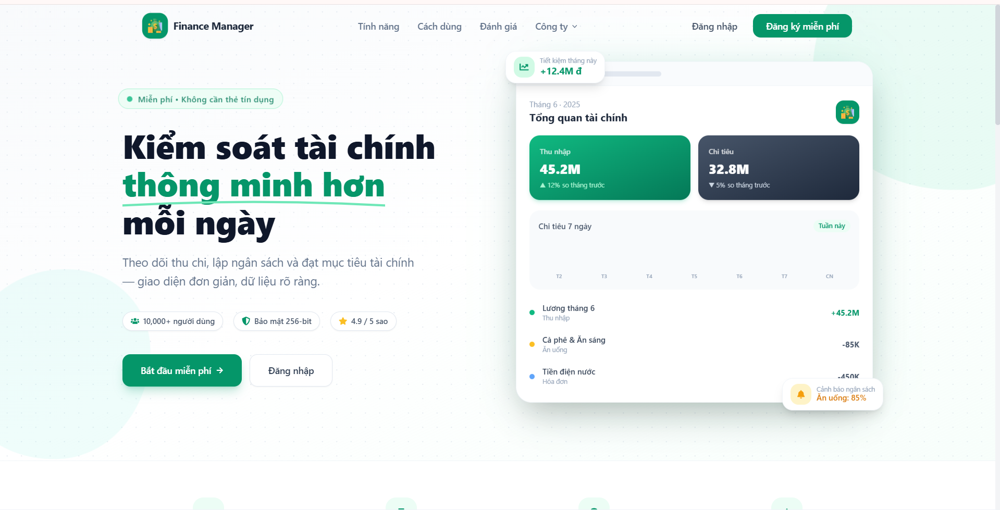
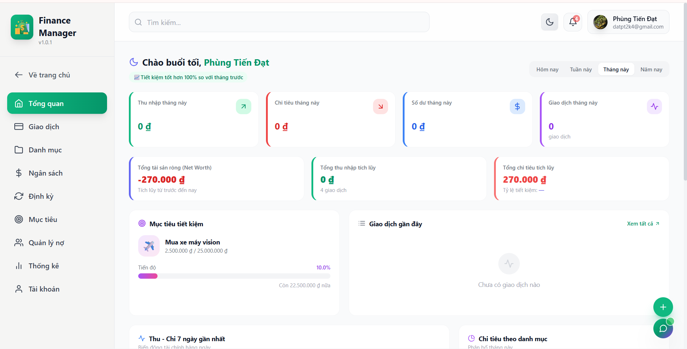
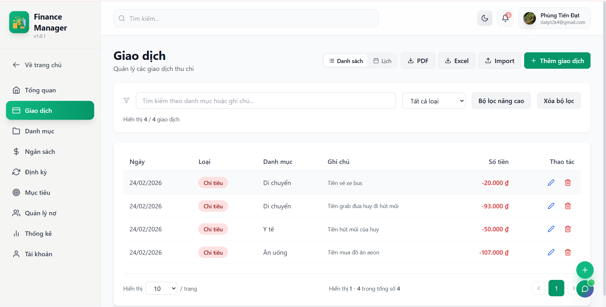
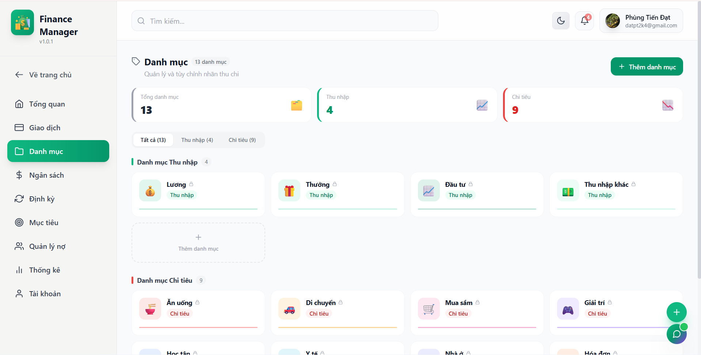
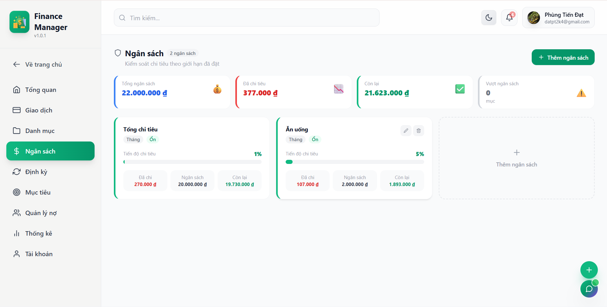
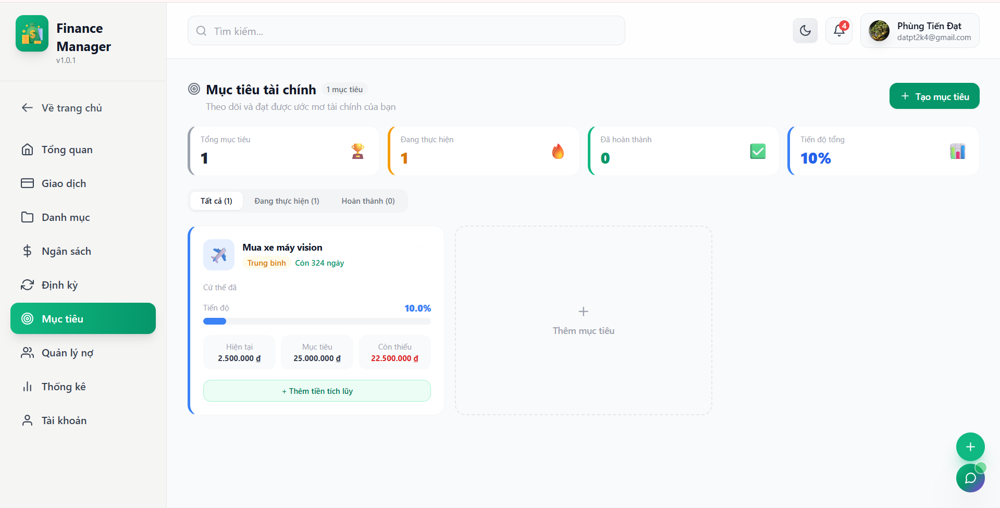
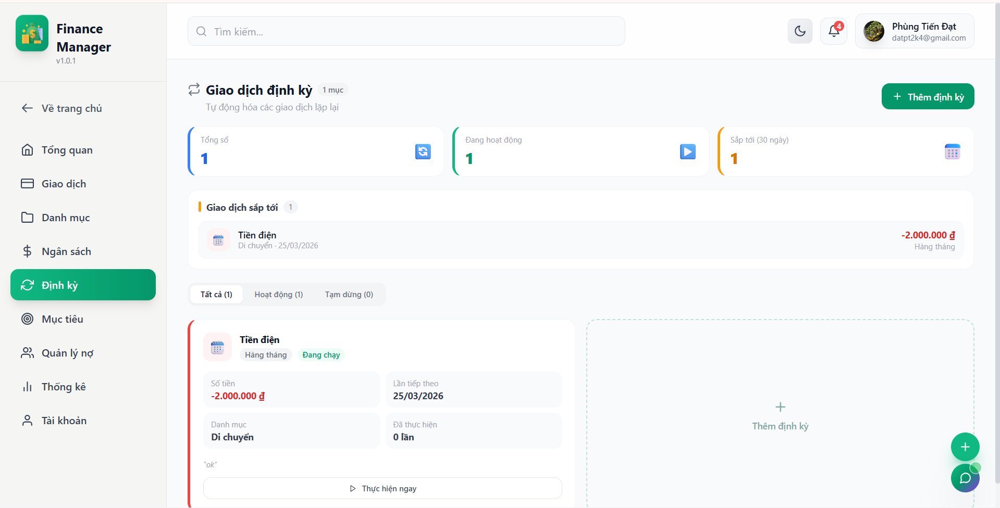
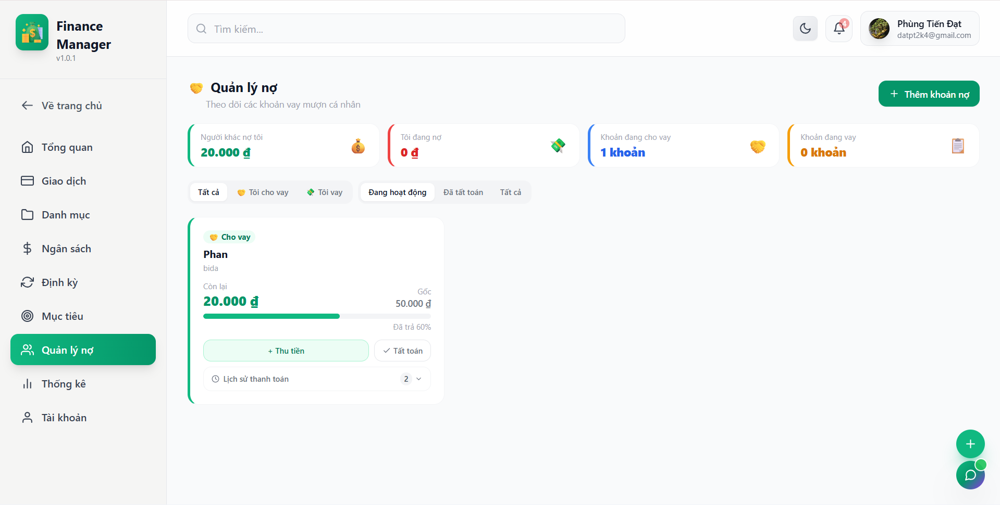
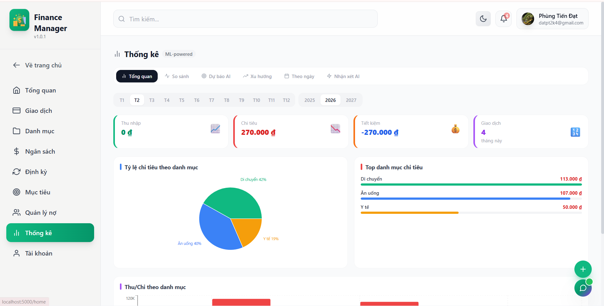
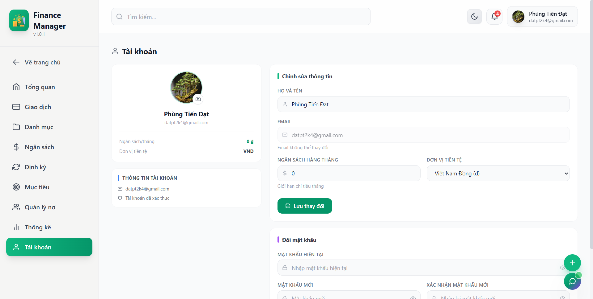

# Personal Finance Manager

Ứng dụng web full-stack quản lý chi tiêu cá nhân, tập trung vào 3 bài toán chính: theo dõi dòng tiền, kiểm soát ngân sách và ra quyết định dựa trên dữ liệu thống kê.

README này được viết theo hướng nhà tuyển dụng có thể đọc nhanh trong 1-2 phút để nắm rõ dự án làm gì, sử dụng công nghệ gì và thể hiện năng lực kỹ thuật ra sao.

## 1) Tổng quan nhanh

- Bài toán: người dùng cá nhân thường khó theo dõi thu chi, dễ vượt ngân sách và thiếu góc nhìn tổng quan tài chính.
- Giải pháp: ứng dụng hỗ trợ quản lý giao dịch, mục tiêu tiết kiệm, khoản nợ, giao dịch định kỳ, thống kê biểu đồ, tìm kiếm toàn cục và xuất báo cáo.
- Giá trị kỹ thuật: kiến trúc tách `client/server`, REST API, xác thực JWT + refresh token, cron job tự động hóa, có kiểm thử cho cả frontend và backend.

## 2) Chức năng chính

### Quản lý tài chính cốt lõi
- Quản lý giao dịch thu/chi: thêm, sửa, xóa, lọc, tìm kiếm, phân trang.
- Quản lý danh mục: icon, màu sắc, tùy biến theo ngữ cảnh chi tiêu.
- Quản lý ngân sách: theo danh mục/tổng thể, cảnh báo ngưỡng, theo dõi tiến độ.
- Quản lý mục tiêu: tạo mục tiêu tiết kiệm, nạp thêm tiền, theo dõi hạn và tiến độ.
- Quản lý giao dịch định kỳ: lặp theo ngày/tuần/tháng/năm, kích hoạt/tạm dừng, xem lịch sắp tới.
- Quản lý khoản nợ: theo dõi và cập nhật trạng thái nợ.

### Phân tích và năng suất
- Dashboard tổng quan (thu, chi, số dư, xu hướng).
- Biểu đồ theo thời gian và theo danh mục (`Recharts`, `Chart.js`).
- Tìm kiếm toàn cục (multi-module search).
- Xuất dữ liệu/báo cáo: PDF và Excel (`jspdf`, `xlsx`).
- Hỗ trợ đa tiền tệ, dark/light mode, responsive.

### Bảo mật và độ tin cậy
- Đăng ký/đăng nhập, hồ sơ cá nhân, quên mật khẩu qua email.
- JWT access token + refresh token, protected routes.
- Mã hóa mật khẩu bằng `bcryptjs`.
- Rate limit, validate request, xử lý lỗi tập trung.

## 3) Kiến trúc và phạm vi

### Kiến trúc
- Frontend: React SPA (`client/`) sử dụng Context API + service layer.
- Backend: Node.js/Express (`server/`) theo hướng MVC + middleware.
- Cơ sở dữ liệu: MongoDB với Mongoose.
- Tự động hóa: `node-cron` cho recurring transactions.

### Các module API chính
- `auth`, `transactions`, `categories`, `budgets`, `goals`, `recurring`
- `debts`, `notifications`, `stats`, `search`, `import`, `chat`, `contact`

## 4) Công nghệ sử dụng

### Frontend
- `React 18`, `Vite`, `TailwindCSS`, `React Router v6`
- `Axios`, `React Context API`
- `Recharts`, `Chart.js`, `react-chartjs-2`
- `Framer Motion`, `GSAP`
- `React Toastify`, `React Icons`
- `jsPDF`, `jspdf-autotable`, `xlsx`
- Kiểm thử: `Vitest`, `Testing Library`

### Backend
- `Node.js`, `Express`, `MongoDB`, `Mongoose`
- `jsonwebtoken`, `bcryptjs`, `express-validator`
- `express-rate-limit`, `cors`, `dotenv`
- `multer` (upload), `nodemailer` (email), `node-cron`
- Import dữ liệu: `csv-parse`, `xlsx`
- Kiểm thử: `Jest`, `Supertest`, `mongodb-memory-server`

### Tooling
- Lint: `ESLint`
- Build executable backend trên Windows: `esbuild` + `pkg`

## 5) Demo giao diện (screenshots)

Tất cả ảnh demo được lấy trực tiếp từ thư mục `assets/Screenshot/`:

| Xem trước 1 | Xem trước 2 |
| --- | --- |
|  |  |
|  |  |
|  |  |
|  |  |
|  |  |

