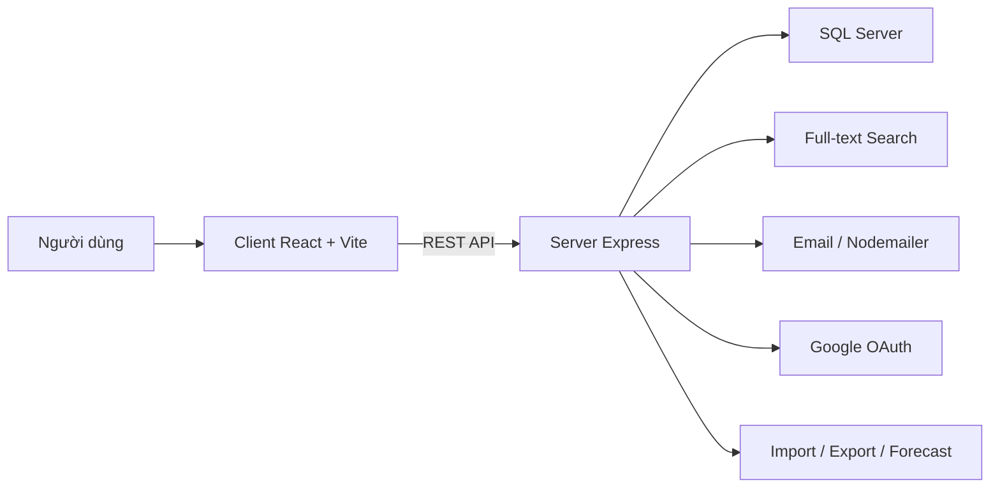

# Personal Finance Manager

Personal Finance Manager là ứng dụng web full-stack quản lý chi tiêu cá nhân, được xây dựng để giải quyết bài toán theo dõi thu chi, kiểm soát ngân sách, đặt mục tiêu tài chính và tra cứu dữ liệu nhanh bằng tìm kiếm toàn cục.

Ứng dụng được tách rõ thành hai phần: frontend chạy bằng React/Vite và backend chạy bằng Node.js/Express, kết nối với SQL Server qua Sequelize. Tìm kiếm toàn cục được thiết kế để sử dụng một FTS engine; hiện đang sử dụng truy vấn cơ sở dữ liệu làm fallback tạm thời.

## Mục tiêu của dự án

- Giúp người dùng quản lý thu nhập, chi tiêu và số dư theo từng ngày, tháng hoặc khoảng thời gian tùy chọn.
- Hỗ trợ theo dõi ngân sách, khoản nợ, mục tiêu tiết kiệm và lịch sử giao dịch.
- Cung cấp biểu đồ, thống kê, dự báo và các công cụ nhập/xuất dữ liệu để hỗ trợ phân tích tài chính cá nhân.
- Tích hợp các luồng đăng nhập hiện đại như Google OAuth và xử lý gửi email để phục vụ khôi phục mật khẩu, thông báo hoặc liên hệ.

## Tính năng nổi bật

- **Xác thực an toàn:** Đăng ký, đăng nhập, đăng xuất, quên mật khẩu qua OTP email và xác thực hai lớp bằng JWT; hỗ trợ đăng nhập nhanh bằng **Google OAuth**.
- **Quản lý tài chính cá nhân:** Ghi chép thu chi chi tiết, quản lý danh mục phân loại, ngân sách chi tiêu định kỳ, theo dõi khoản nợ và lập mục tiêu tiết kiệm.
- **Cố vấn tài chính thông minh (Smart Advisor):** Hệ chuyên gia phân tích sức khỏe tài chính dựa trên quy tắc 50/30/20, 6 chiếc lọ, phát hiện các giao dịch bất thường bằng phân tích thống kê lịch sử chi tiêu, và cảnh báo nguy cơ vượt ngân sách hoặc chậm mục tiêu.
- **Đọc hóa đơn tự động (AI OCR):** Trích xuất tự động số tiền từ ảnh hóa đơn bằng công nghệ nhận dạng ký tự quang học **Tesseract.js** trực tiếp ở Client-side.
- **Thanh toán trực tuyến PayOS:** Tích hợp cổng thanh toán PayOS để nâng cấp và gia hạn tài khoản VIP tự động.
- **Lưu trữ đám mây:** Hỗ trợ tải lên và quản lý ảnh hóa đơn/ảnh đính kèm giao dịch thông qua **Cloudinary**.
- **Dashboard & Báo cáo:** Trực quan hóa dữ liệu bằng hệ thống biểu đồ thông minh, hỗ trợ import dữ liệu hàng loạt từ CSV/Excel và xuất báo cáo PDF/Excel chuyên nghiệp.
- **Trang Admin quản trị toàn diện:** Quản trị danh sách người dùng, theo dõi lượt truy cập (visits), phê duyệt giao dịch VIP và tiếp nhận ý kiến phản hồi liên hệ.
- **Trải nghiệm người dùng cao cấp:** Dark mode mượt mà, Onboarding hướng dẫn người dùng mới, và các hiệu ứng chuyển trang/modal tương tác sinh động.

## Công nghệ sử dụng

### Frontend

- **Core:** React 18, Vite (Build tool), React Router DOM (Điều hướng)
- **Styling & Animations:** Tailwind CSS (Giao diện hiện đại), Framer Motion & GSAP (Hiệu ứng micro-interaction mượt mà)
- **Data & Charts:** Chart.js, react-chartjs-2, Recharts (Biểu đồ trực quan)
- **AI OCR:** Tesseract.js (Nhận diện chữ viết từ ảnh hóa đơn client-side)
- **Integrations:** Axios (Kết nối API), @react-oauth/google (Xác thực Google)
- **Export & Reports:** jsPDF, jspdf-autotable, XLSX (Xuất báo cáo PDF/Excel)
- **Testing:** Vitest, Testing Library (Kiểm thử UI)

### Backend

- **Core:** Node.js, Express (REST API Engine)
- **Database & ORM:** SQL Server (Cơ sở dữ liệu chính qua `tedious`), Sequelize ORM (Quản lý Schema và Models)
- **Integrations:**
  - @payos/node (Tích hợp cổng thanh toán PayOS)
  - Cloudinary SDK (Lưu trữ hình ảnh đính kèm đám mây)
  - Nodemailer (Gửi email khôi phục mật khẩu và thông báo)
- **Security:** JWT (Mã hóa xác thực), bcryptjs (Băm mật khẩu), express-rate-limit (Ngăn chặn tấn công spam API/Brute force), express-validator (Kiểm thực đầu vào)
- **Data Processing & ML:** csv-parse & multer (Xử lý file upload/import), simple-statistics & ml (Tính toán thống kê sức khỏe tài chính & thuật toán dự báo xu hướng chi tiêu)
- **Testing:** Jest, Supertest (Kiểm thử API)

### Hạ tầng dữ liệu và tích hợp

- SQL Server là nguồn dữ liệu chính.
FTS engine được đồng bộ dữ liệu và cấu trúc index để phục vụ tìm kiếm nhanh.
- Google OAuth dùng cho xác thực bên thứ ba.
- Gmail App Password dùng cho gửi email.
- SQLite chỉ dùng cho môi trường test khi bật `FORCE_SQLITE_IN_TESTS`.

## Kiến trúc tổng thể



Luồng chính của hệ thống:

1. Người dùng thao tác trên frontend React.
2. Frontend gọi API sang backend qua `VITE_API_URL`.
3. Backend xác thực, xử lý nghiệp vụ và đọc/ghi dữ liệu trên SQL Server.
4. Khi cần tìm kiếm nhanh, backend sẽ truy vấn engine FTS nếu được cấu hình, hoặc dùng truy vấn cơ sở dữ liệu làm fallback.
5. Các tác vụ phụ trợ như email, import file, thống kê, dự báo và admin được xử lý ở tầng server.

## Cấu trúc thư mục

### Gốc dự án

- `README.md`: tài liệu tổng quan và hướng dẫn chạy dự án.
- `build-exe.bat`: script build bản `.exe` cho Windows.
- `docs/`: tài liệu học thuật, sơ đồ UML, mô tả nghiệp vụ và tích hợp Google Login.
- `client/`: ứng dụng frontend.
- `server/`: ứng dụng backend và các script đồng bộ dữ liệu.
- `assets/`: tài nguyên hình ảnh, screenshot demo.

### `client/`

- `src/main.jsx`: điểm vào của ứng dụng React.
- `src/App.jsx`: cấu trúc router và layout tổng thể.
- `src/index.css`: style toàn cục và Tailwind base.
- `src/pages/`: các màn hình nghiệp vụ và trang public/admin.
- `src/components/`: các component dùng lại như modal, layout, search, calendar, pagination, route guard.
- `src/context/`: state dùng chung như auth, theme, user hoặc app-level state.
- `src/services/`: lớp gọi API từ frontend.
- `src/utils/`: hàm tiện ích, format tiền, ngày tháng, validation.
- `src/tests/`: kiểm thử giao diện.

### `server/`

- `src/index.js`: điểm khởi động backend.
- `src/app.js`: cấu hình Express, middleware và route.
	- `src/config/`: cấu hình database, SQL Server và (FTS engine — nếu có).
- `src/controllers/`: xử lý nghiệp vụ cho từng nhóm chức năng.
- `src/routes/`: khai báo endpoint REST.
- `src/models/sequelize/`: định nghĩa model và quan hệ Sequelize.
- `src/middleware/`: middleware xác thực và xử lý lỗi.
	- `src/services/`: dịch vụ FTS (nếu có), dự báo, logic hỗ trợ.
- `src/utils/`: hàm tiện ích như gửi email.
	- `scripts/`: script setup index và đồng bộ dữ liệu (FTS-related scripts removed/replaced).
- `tests/`: kiểm thử backend.

## Giải thích các file quan trọng

### Frontend

- `client/src/pages/Dashboard.jsx`: trang tổng quan số liệu, biểu đồ và dữ liệu nổi bật.
- `client/src/pages/Transactions.jsx`: quản lý giao dịch thu/chi.
- `client/src/pages/Categories.jsx`: quản lý nhóm danh mục thu chi.
- `client/src/pages/Budgets.jsx`: quản lý ngân sách theo kỳ.
- `client/src/pages/Goals.jsx`: quản lý mục tiêu tài chính.
- `client/src/pages/Debts.jsx`: quản lý khoản nợ.
- `client/src/pages/Statistics.jsx`: phân tích và biểu đồ chi tiêu.
- `client/src/pages/Login.jsx`, `Register.jsx`, `ForgotPassword.jsx`: xác thực tài khoản.
- `client/src/pages/AdminDashboard.jsx`, `AdminUsers.jsx`, `AdminContacts.jsx`: khu vực quản trị.
- `client/src/components/TransactionModal.jsx`, `BudgetModal.jsx`, `GoalModal.jsx`, `DebtModal.jsx`, `CategoryModal.jsx`: form tạo/sửa dữ liệu.
- `client/src/components/GlobalSearch.jsx`: ô tìm kiếm toàn cục.
- `client/src/components/TransactionCalendar.jsx`: xem giao dịch theo lịch.
- `client/src/components/ImportModal.jsx`: nhập dữ liệu từ file.
- `client/src/components/PrivateRoute.jsx`, `PublicRoute.jsx`: chặn truy cập theo trạng thái đăng nhập.
- `client/src/components/Layout.jsx`: khung bố cục chính của ứng dụng.

### Backend

- `server/src/config/sqlserver.js`: cấu hình kết nối SQL Server.
- `server/src/config/database.js`: lớp cấu hình database chung.
- `server/src/models/sequelize/index.js`: khởi tạo model Sequelize và quan hệ.
- `server/src/controllers/auth.controller.js`: đăng ký, đăng nhập, refresh token, Google login.
- `server/src/controllers/transaction.controller.js`: nghiệp vụ giao dịch và đồng bộ tìm kiếm.
- `server/src/controllers/category.controller.js`: CRUD danh mục.
- `server/src/controllers/budget.controller.js`: CRUD ngân sách.
- `server/src/controllers/goal.controller.js`: CRUD mục tiêu.
- `server/src/controllers/debt.controller.js`: CRUD khoản nợ.
- `server/src/controllers/stats.controller.js`: thống kê, biểu đồ và dự báo.
- `server/src/controllers/import.controller.js`: import dữ liệu từ file.
- `server/src/controllers/notification.controller.js`: thông báo.
- `server/src/controllers/contact.controller.js`: nhận phản hồi liên hệ.
- `server/src/controllers/admin.controller.js`: chức năng quản trị.
- `server/src/services/xgboost.forecast.service.js`: service dự báo chi tiêu.
- `server/src/utils/sendEmail.js`: gửi email bằng Nodemailer.

## Cài đặt môi trường

### Yêu cầu trước khi chạy

- Node.js LTS trở lên.
- npm đi kèm Node.js.
- SQL Server đang chạy và có database phù hợp.
- Tài khoản Google nếu muốn bật đăng nhập Google.
- Gmail App Password nếu muốn bật gửi email.

### Cài đặt dependencies

```bash
cd client
npm install

cd ../server
npm install
```

### Cấu hình `server/.env`

Tạo hoặc chỉnh file `server/.env` với các biến chính sau:

```env
NODE_ENV=development
PORT=5000
DB_TYPE=sqlserver

SQLSERVER_HOST=localhost
SQLSERVER_PORT=1433
SQLSERVER_USER=sa
SQLSERVER_PASSWORD=your-sql-password
SQLSERVER_DATABASE=FinanceManager
SQLSERVER_ENCRYPT=false

JWT_SECRET=replace-with-a-long-random-secret
JWT_EXPIRE=7d

GOOGLE_CLIENT_ID=your-google-client-id.apps.googleusercontent.com
GOOGLE_CLIENT_SECRET=your-google-client-secret

EMAIL_USER=your-email@gmail.com
EMAIL_PASS=your-gmail-app-password

CLIENT_URL=http://localhost:5173

	# FTS engine host/key removed; configure your chosen FTS engine if needed
```

### Cấu hình frontend

Tạo file `client/.env` nếu chưa có:

```env
VITE_API_URL=http://localhost:5000/api
VITE_GOOGLE_CLIENT_ID=your-google-client-id.apps.googleusercontent.com
```

## Chạy dự án ở môi trường phát triển

### Backend

```bash
cd server
npm run dev
```

### Frontend

```bash
cd client
npm run dev
```

Mặc định frontend chạy ở `http://localhost:5173`, backend chạy ở `http://localhost:5000`.

## Full-text search (FTS)

FTS engine support has been removed from the project. Full-text search is implemented
as a pluggable component; currently the backend falls back to database `LIKE` queries.

If you plan to add a dedicated FTS engine, consult the project maintainer or add documentation under `docs/`.
for historical notes and create new setup/sync scripts for your chosen engine.

## Chạy kiểm thử

### Backend

```bash
cd server
npm test
```

### Frontend

```bash
cd client
npm test
```

## Build bản Windows `.exe`

Backend có script build sẵn trong `server/package.json` và file batch ở gốc dự án.

```bash
cd server
npm run build:exe
```

Hoặc dùng file `build-exe.bat` nếu muốn chạy theo quy trình Windows.

## Một số chức năng quan trọng

- Dashboard tổng quan theo thời gian.
- CRUD giao dịch, danh mục, ngân sách, mục tiêu và khoản nợ.
- Tìm kiếm toàn cục bằng FTS engine.
 - Tìm kiếm toàn cục (FTS engine — pluggable; hiện dùng truy vấn DB làm fallback).
- Đăng nhập Google và đăng nhập bằng email/mật khẩu.
- Quên mật khẩu và gửi mail xác thực.
- Import dữ liệu từ file Excel/CSV.
- Export báo cáo ra file.
- Trang admin để quản trị người dùng và liên hệ.
- Phân tích thống kê và dự báo chi tiêu.

## Lưu ý triển khai

- Không đưa file `.env`, dữ liệu thật hoặc secret lên Git.
- Không commit `server/data.ms`, `server/dumps` hoặc binary của engine tìm kiếm.
 - Không commit `server/dumps` hoặc binary/engine data lên Git.
- Khi chạy local trên Windows, nên dùng `http://127.0.0.1:7700` thay vì `localhost` để tránh lỗi phân giải IPv6.
- If you use a separate FTS engine, follow its docs for setup and sync.

## Tài liệu liên quan
- [docs/GOOGLE_LOGIN_IMPLEMENTATION.md](docs/GOOGLE_LOGIN_IMPLEMENTATION.md)
- [docs/SSO_INTEGRATION.md](docs/SSO_INTEGRATION.md)

## Kết luận

Dự án này là một hệ thống quản lý chi tiêu cá nhân có đầy đủ nền tảng kỹ thuật cho một sản phẩm thực tế: kiến trúc client/server rõ ràng, xác thực an toàn, tích hợp tìm kiếm tốc độ cao, thống kê, dự báo, import/export và các luồng quản trị cần thiết.


