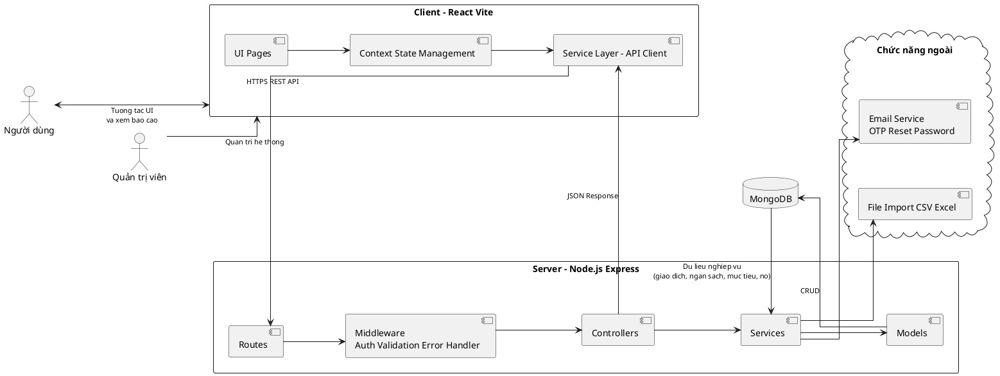
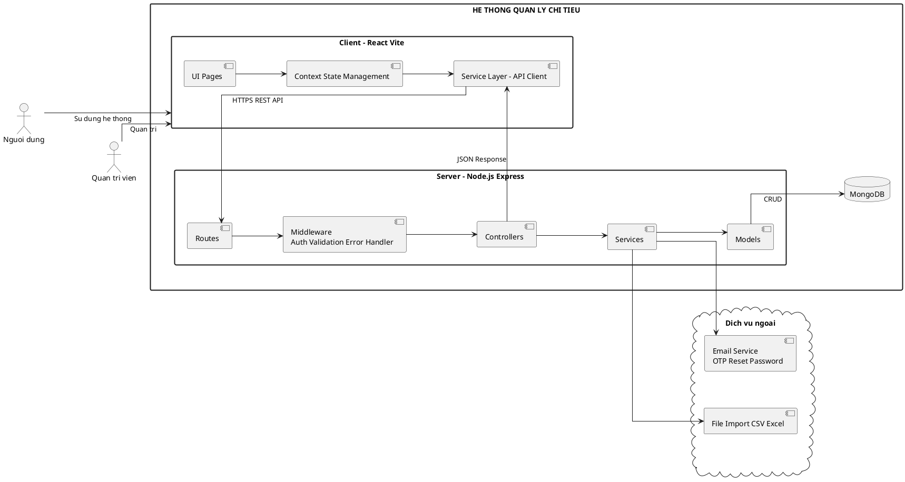

# BIEU DO HE THONG TONG QUAN (PLANTUML)

## Mo ta
Bieu do ben duoi mo ta kien truc tong quan cho he thong Quan ly chi tieu, gom Frontend, Backend, CSDL va cac dich vu ngoai.

## Cach xuat thanh anh
1. Cai extension PlantUML trong VS Code (neu chua co).
2. Mo file nay, dat con tro trong khoi PlantUML.
3. Mo command palette va chay lenh PlantUML: Preview Current Diagram.
4. Chon Export Current Diagram de xuat PNG/SVG (nen chon bo cuc trang ngang 16:9 de dung khung chu nhat).

## Phien ban khung chu nhat day (de dua vao bao cao)

