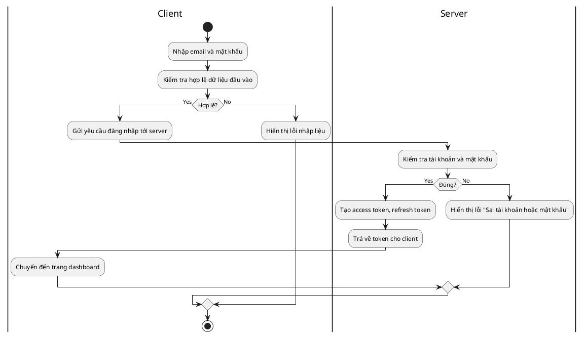

# Biểu đồ hoạt động: Đăng nhập

## Mô tả hoạt động chức năng đăng nhập

Biểu đồ hoạt động dưới đây mô tả quy trình xử lý khi người dùng thực hiện đăng nhập vào hệ thống:

1. **Người dùng nhập email và mật khẩu** vào giao diện đăng nhập.
2. **Hệ thống kiểm tra tính hợp lệ của dữ liệu đầu vào** (ví dụ: định dạng email, mật khẩu không được để trống).
   - Nếu dữ liệu không hợp lệ, hệ thống sẽ **hiển thị thông báo lỗi nhập liệu** để người dùng nhập lại.
   - Nếu dữ liệu hợp lệ, hệ thống sẽ **gửi yêu cầu đăng nhập tới server**.
3. **Server kiểm tra tài khoản và mật khẩu**:
   - Nếu thông tin không chính xác, server trả về thông báo lỗi "Sai tài khoản hoặc mật khẩu".
   - Nếu thông tin chính xác, server sẽ **tạo access token và refresh token**, trả về cho client.
4. **Client nhận được token** và **chuyển hướng người dùng đến trang dashboard** nếu đăng nhập thành công.

Quy trình này giúp đảm bảo chỉ những người dùng hợp lệ mới có thể truy cập vào hệ thống, đồng thời cung cấp phản hồi rõ ràng khi có lỗi xảy ra trong quá trình đăng nhập.

---

