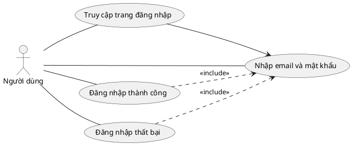
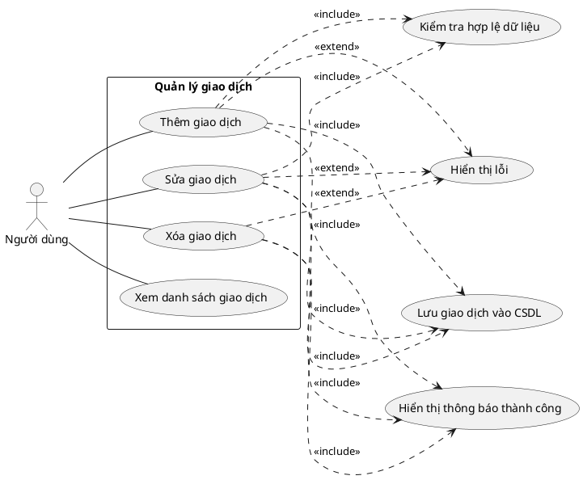
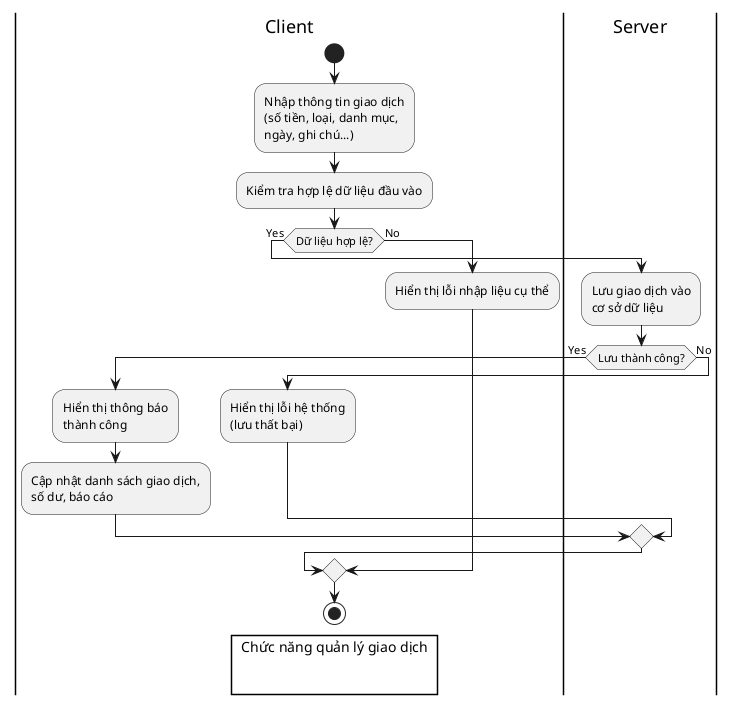

# Đặc tả Use Case: Đăng nhập

- **Tên use case:** Đăng nhập hệ thống
- **Tác nhân:** Người dùng
- **Mục đích:** Cho phép người dùng truy cập vào hệ thống với tài khoản hợp lệ.
- **Trigger:** Người dùng truy cập trang đăng nhập và nhập thông tin.
- **Tiền điều kiện:** Người dùng đã có tài khoản hợp lệ.
- **Hậu điều kiện:** Người dùng đăng nhập thành công, được chuyển đến trang dashboard.
- **Luồng sự kiện chính:**
  1. Người dùng truy cập trang đăng nhập.
  2. Nhập email và mật khẩu.
  3. Hệ thống kiểm tra tính hợp lệ của dữ liệu đầu vào.
  4. Nếu hợp lệ, gửi yêu cầu xác thực tới server.
  5. Server kiểm tra thông tin tài khoản.
  6. Nếu đúng, trả về token và chuyển hướng người dùng đến dashboard.
- **Luồng phụ/ngoại lệ:**
  - Nếu dữ liệu đầu vào không hợp lệ: Hệ thống hiển thị thông báo lỗi nhập liệu.
  - Nếu tài khoản hoặc mật khẩu sai: Hệ thống hiển thị thông báo lỗi xác thực.
  - Nếu server không phản hồi hoặc lỗi hệ thống: Hiển thị thông báo lỗi hệ thống.
- **Yêu cầu đặc biệt:** Giao diện phải thân thiện, bảo mật thông tin đăng nhập.
- **Ghi chú:** Có thể bổ sung xác thực hai lớp (2FA) nếu cần.

---

# Biểu đồ Use Case: Đăng nhập

---

# Biểu đồ Use Case: Quản lý giao dịch

## Mô tả
Biểu đồ use case trên mô tả chức năng quản lý giao dịch của hệ thống. Tác nhân "Người dùng" có thể thực hiện các thao tác chính như: Thêm giao dịch, Sửa giao dịch, Xóa giao dịch và Xem danh sách giao dịch. Các chức năng con này đều thuộc phạm vi quản lý giao dịch, giúp người dùng kiểm soát và cập nhật thông tin tài chính cá nhân một cách linh hoạt.

---

# Biểu đồ hoạt động: Giao dịch

## Mô tả hoạt động chức năng giao dịch

Biểu đồ hoạt động dưới đây mô tả chi tiết quy trình xử lý khi người dùng thực hiện thêm mới một giao dịch vào hệ thống:

1. **Người dùng nhập thông tin giao dịch** gồm các trường: số tiền, loại giao dịch (thu/chi), danh mục, ngày thực hiện, ghi chú (nếu có), v.v.
2. **Hệ thống kiểm tra tính hợp lệ của dữ liệu đầu vào**:
   - Kiểm tra các trường bắt buộc đã được nhập đầy đủ chưa.
   - Kiểm tra định dạng số tiền, ngày tháng, v.v.
   - Nếu dữ liệu không hợp lệ, hệ thống sẽ **hiển thị thông báo lỗi** cụ thể để người dùng biết và sửa lại.
3. Nếu dữ liệu hợp lệ, hệ thống sẽ **lưu thông tin giao dịch vào cơ sở dữ liệu**.
   - Nếu lưu thành công, hệ thống **hiển thị thông báo thành công**, cập nhật lại danh sách giao dịch, số dư, báo cáo liên quan (nếu có).
   - Nếu lưu thất bại (ví dụ: lỗi kết nối cơ sở dữ liệu), hệ thống **hiển thị thông báo lỗi hệ thống** để người dùng biết.

---

