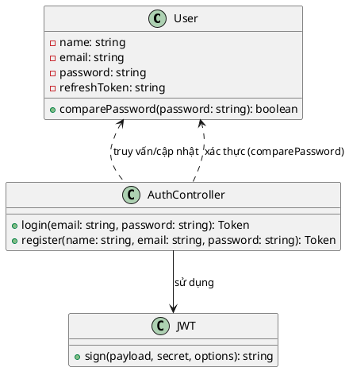

# Biểu đồ lớp (Class Diagram) cho chức năng Đăng nhập

## Mô tả
Biểu đồ lớp dưới đây mô tả các thành phần chính tham gia vào quá trình đăng nhập của hệ thống dựa trên mã nguồn thực tế:

- **User**: Đại diện cho người dùng, lưu trữ thông tin tài khoản (email, password, refreshToken, v.v.), cung cấp phương thức so sánh mật khẩu (`comparePassword`).
- **AuthController**: Xử lý các yêu cầu đăng nhập, đăng ký, tạo token, xác thực thông tin người dùng, lưu refreshToken vào User.
- **JWT (jsonwebtoken)**: Thư viện dùng để sinh access token và refresh token.

Các mối quan hệ:
- `AuthController` truy vấn và cập nhật thông tin `User` từ database.
- `AuthController` sử dụng thư viện `JWT` để sinh token.
- `User` cung cấp phương thức `comparePassword` để xác thực mật khẩu.

## Biểu đồ lớp

