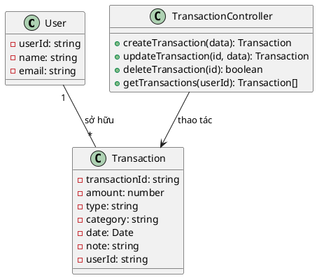

# Biểu đồ lớp (Class Diagram) cho chức năng Giao dịch

## Mô tả
Biểu đồ lớp dưới đây mô tả các thành phần chính tham gia vào chức năng quản lý giao dịch của hệ thống:

- **Transaction**: Đại diện cho một giao dịch, lưu trữ thông tin như số tiền, loại giao dịch (thu/chi), danh mục, ngày, ghi chú, người sở hữu (userId).
- **TransactionController**: Xử lý các yêu cầu thêm, sửa, xóa, xem giao dịch từ phía client.
- **TransactionService** (nếu có): Xử lý logic nghiệp vụ liên quan đến giao dịch (có thể gộp vào controller nếu dự án không tách riêng service).
- **User**: Đại diện cho người dùng, liên kết với các giao dịch của họ.

Các mối quan hệ:
- `TransactionController` thao tác với `Transaction` (tạo, sửa, xóa, truy vấn).
- `Transaction` liên kết với `User` qua thuộc tính userId.

## Biểu đồ lớp

