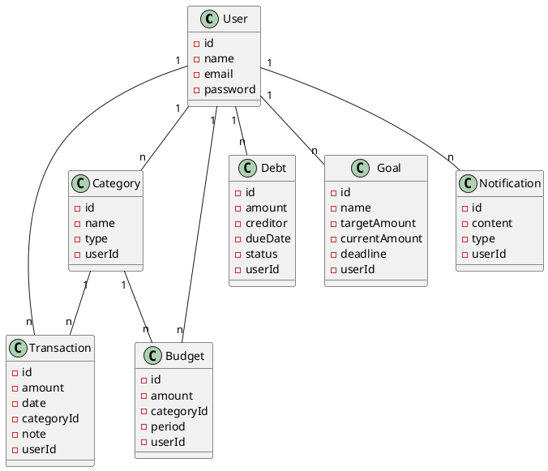

# Biểu đồ lớp cơ sở dữ liệu quan hệ

## Mô tả
Biểu đồ lớp dưới đây mô tả các bảng chính trong cơ sở dữ liệu và mối quan hệ giữa chúng trong hệ thống quản lý chi tiêu:

- **User**: Lưu thông tin người dùng, là bảng trung tâm liên kết với các bảng khác.
- **Transaction**: Lưu các giao dịch thu/chi, liên kết với User (người sở hữu) và Category (danh mục).
- **Category**: Lưu các danh mục giao dịch, liên kết với User và Transaction.
- **Budget**: Lưu thông tin ngân sách theo danh mục, liên kết với User và Category.
- **Debt**: Lưu thông tin các khoản nợ, liên kết với User.
- **Goal**: Lưu mục tiêu tài chính, liên kết với User.
- **Notification**: Lưu thông báo gửi cho người dùng, liên kết với User.

Các mối quan hệ:
- Một User có thể có nhiều Transaction, Category, Budget, Debt, Goal, Notification.
- Một Category có thể có nhiều Transaction và Budget.

## Biểu đồ lớp

