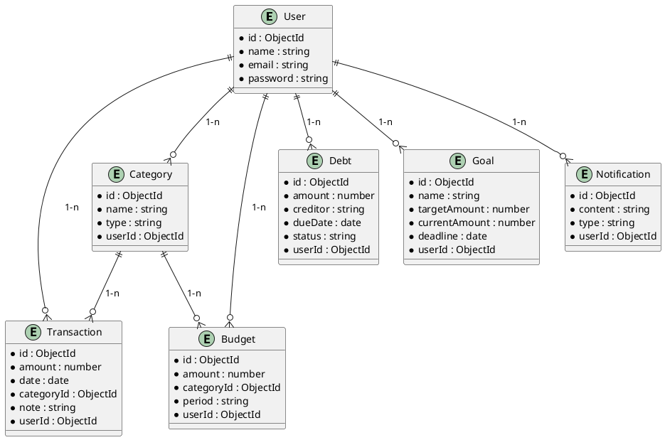

# Biểu đồ quan hệ dữ liệu (ERD)

```plantuml
@startuml
entity "User" as user {
  *id : ObjectId
  *name : string
  *email : string
  *password : string
}
entity "Transaction" as transaction {
  *id : ObjectId
  *amount : number
  *date : date
  *categoryId : ObjectId
  *note : string
  *userId : ObjectId
}
entity "Category" as category {
  *id : ObjectId
  *name : string
  *type : string
  *userId : ObjectId
}
entity "Budget" as budget {
  *id : ObjectId
  *amount : number
  *categoryId : ObjectId
  *period : string
  *userId : ObjectId
}
entity "Debt" as debt {
  *id : ObjectId
  *amount : number
  *creditor : string
  *dueDate : date
  *status : string
  *userId : ObjectId
}
entity "Goal" as goal {
  *id : ObjectId
  *name : string
  *targetAmount : number
  *currentAmount : number
  *deadline : date
  *userId : ObjectId
}
entity "Notification" as notification {
  *id : ObjectId
  *content : string
  *type : string
  *userId : ObjectId
}

user ||--o{ transaction : "1-n"
user ||--o{ category : "1-n"
user ||--o{ budget : "1-n"
user ||--o{ debt : "1-n"
user ||--o{ goal : "1-n"
user ||--o{ notification : "1-n"
category ||--o{ transaction : "1-n"
category ||--o{ budget : "1-n"
@enduml
```
