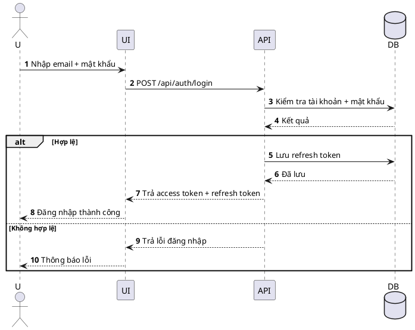

# Biểu đồ trình tự chức năng đăng nhập

```plantuml
@startuml
autonumber
actor U as User
participant UI
participant API
database DB

User -> UI: Nhập email + mật khẩu
UI -> API: POST /api/auth/login
API -> DB: Kiểm tra tài khoản + mật khẩu
DB --> API: Kết quả

alt Hợp lệ
  API -> DB: Lưu refresh token
  DB --> API: Đã lưu
  API --> UI: Trả access token + refresh token
  UI --> User: Đăng nhập thành công
else Không hợp lệ
  API --> UI: Trả lỗi đăng nhập
  UI --> User: Thông báo lỗi
end
@enduml
```
