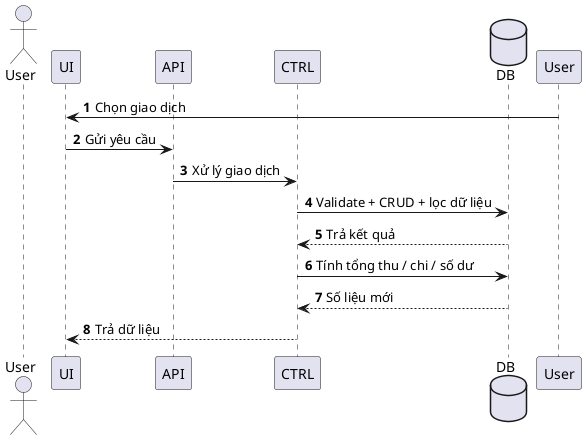

# Biểu đồ trình tự chức năng giao dịch

```plantuml
@startuml
autonumber
actor User as U
participant UI
participant API
participant CTRL
database DB

User -> UI: Chọn giao dịch
UI -> API: Gửi yêu cầu
API -> CTRL: Xử lý giao dịch
CTRL -> DB: Validate + CRUD + lọc dữ liệu
DB --> CTRL: Trả kết quả
CTRL -> DB: Tính tổng thu / chi / số dư
DB --> CTRL: Số liệu mới
CTRL --> UI: Trả dữ liệu
@enduml
```
