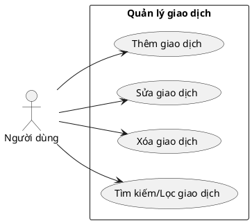

# Biểu đồ Usecase chi tiết: Giao dịch

## Đặc tả usecase
- Thêm giao dịch: Người dùng nhập thông tin, hệ thống kiểm tra hợp lệ, lưu vào DB.
- Sửa giao dịch: Người dùng chọn giao dịch, chỉnh sửa, hệ thống kiểm tra và cập nhật.
- Xóa giao dịch: Người dùng chọn giao dịch, xác nhận xóa, hệ thống xóa khỏi DB.
- Tìm kiếm/Lọc: Người dùng nhập từ khóa/bộ lọc, hệ thống trả về danh sách phù hợp.
