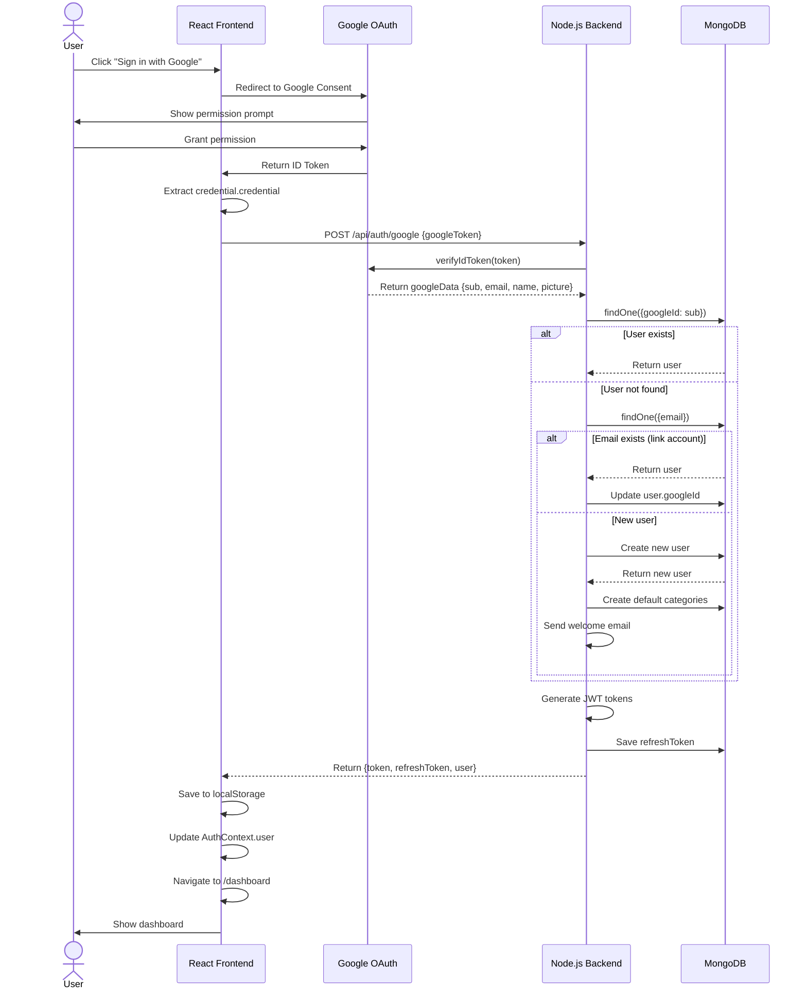

# BÁO CÁO PHẦN 2.6: TÍCH HỢP ĐĂNG NHẬP BẰNG GOOGLE (OAuth 2.0)

## 1. GIỚI THIỆU

Phần 2.6 của dự án tập trung vào việc tích hợp xác thực bằng Google OAuth 2.0, cho phép người dùng đăng nhập/đăng ký bằng tài khoản Google mà không cần tạo mật khẩu riêng. Tính năng này nâng cao trải nghiệm người dùng (UX), giảm bớt các bước đăng ký phức tạp, và cung cấp lựa chọn xác thực an toàn.

---

## 2. MỤC TIÊU

- **Cải thiện UX**: Người dùng có thể đăng nhập nhanh chóng chỉ với 1 click
- **Bảo mật**: Sử dụng OAuth 2.0 được quản lý bởi Google, an toàn hơn
- **Sự linh hoạt**: Cho phép liên kết tài khoản Google với email hiện có
- **Hỗ trợ đa thiết bị**: Hoạt động trên tất cả nền tảng (web, mobile)

---

## 3. KIẾN TRÚC TOÀN CẢNH

### 3.1 Sơ đồ luồng đăng nhập Google

```
┌─────────────────┐
│   User Browser  │ ──→ 1. Click "Sign in with Google"
└─────────────────┘
         │
         ↓ 2. Redirect to Google OAuth consent screen
┌─────────────────────────────────────┐
│  Google OAuth 2.0 Consent Screen    │
│  (Hiển thị quyền truy cập)          │
└─────────────────────────────────────┘
         │
         ↓ 3. User grants permission
         │   Google returns ID token
┌─────────────────────────────────────┐
│  React Frontend (@react-oauth)      │
│  - Nhận credential từ Google        │
│  - Trích xuất Google ID token       │
└─────────────────────────────────────┘
         │
         ↓ 4. POST /api/auth/google + ID token
┌─────────────────────────────────────┐
│  Node.js/Express Backend            │
│  - Verify token với Google API      │
│  - Tìm/tạo user trong DB            │
│  - Tạo JWT tokens (access + refresh)│
└─────────────────────────────────────┘
         │
         ↓ 5. Trả access token + refresh token + user info
┌─────────────────┐
│  Frontend Store │ ──→ localStorage
│  (Auth Context) │    (token, refreshToken, user)
└─────────────────┘
         │
         ↓ 6. Redirect to Dashboard
┌─────────────────┐
│   Dashboard     │
└─────────────────┘
```

### 3.2 Các thành phần chính

| Thành phần | Vị trí | Vai trò |
|-----------|--------|--------|
| **GoogleOAuthProvider** | `client/src/main.jsx` | Cấp Client ID cho toàn bộ ứng dụng React |
| **GoogleLogin Component** | `client/src/pages/Login.jsx`, `Register.jsx` | Hiển thị nút "Sign in/up with Google" |
| **AuthContext + googleLogin()** | `client/src/context/AuthContext.jsx` | Quản lý trạng thái login, gọi service |
| **auth.service.googleLogin()** | `client/src/services/auth.service.js` | Gọi API `/auth/google` từ backend |
| **POST /api/auth/google** | `server/src/routes/auth.routes.js` | Route xử lý Google login |
| **auth.controller.googleLogin()** | `server/src/controllers/auth.controller.js` | Logic xác thực Google token, tạo/tìm user |
| **OAuth2Client** | Google Auth Library | Xác thực ID token từ Google |
| **User Model** | `server/src/models/User.model.js` | Có trường `googleId` để liên kết tài khoản |

---

## 4. CHI TIẾT CÁC THÀNH PHẦN

### 4.1 Frontend - Cấu hình GoogleOAuthProvider

**File**: [client/src/main.jsx](../client/src/main.jsx)

```jsx
import { GoogleOAuthProvider } from '@react-oauth/google'

ReactDOM.createRoot(document.getElementById('root')).render(
  <GoogleOAuthProvider clientId={import.meta.env.VITE_GOOGLE_CLIENT_ID}>
    <ThemeProvider>
      <App />
    </ThemeProvider>
  </GoogleOAuthProvider>,
)
```

**Ý nghĩa:**
- `GoogleOAuthProvider`: Wrapper provider cung cấp Google Client ID cho toàn bộ ứng dụng
- `VITE_GOOGLE_CLIENT_ID`: Lấy từ biến môi trường trong file `.env` của frontend
- Tất cả component con có thể sử dụng `GoogleLogin` component

---

### 4.2 Frontend - Nút đăng nhập Google

**File**: [client/src/pages/Login.jsx](../client/src/pages/Login.jsx) (dòng 137-150)

```jsx
<div className="flex justify-center">
  <GoogleLogin
    onSuccess={handleGoogleSuccess}
    onError={handleGoogleError}
    type="standard"
    theme="light"
    size="large"
    text="signin"
  />
</div>
```

**Props của GoogleLogin:**
| Props | Giá trị | Ý nghĩa |
|-------|--------|--------|
| `onSuccess` | `handleGoogleSuccess` | Callback khi đăng nhập thành công |
| `onError` | `handleGoogleError` | Callback khi có lỗi |
| `type` | `"standard"` | Hiển thị dạng nút tròn hoặc vuông |
| `theme` | `"light"` | Chủ đề sáng/tối |
| `size` | `"large"` | Kích thước nút |
| `text` | `"signin"/"signup"` | Nhãn trên nút |

**Xử lý khi thành công**:

```jsx
const handleGoogleSuccess = async (credentialResponse) => {
  setError('');
  setLoading(true);
  const result = await googleLogin(credentialResponse.credential);
  setLoading(false);

  if (result.success) {
    navigate('/dashboard');
  } else {
    setError(result.message || 'Đăng nhập Google không thành công!');
  }
};
```

**Luồng:**
1. `credentialResponse.credential` chứa **ID token JWT** từ Google
2. Gọi `googleLogin()` từ `AuthContext`
3. Nếu thành công → Điều hướng tới Dashboard
4. Nếu thất bại → Hiển thị thông báo lỗi

---

### 4.3 Frontend - AuthContext.googleLogin()

**File**: [client/src/context/AuthContext.jsx](../client/src/context/AuthContext.jsx) (dòng 152-163)

```jsx
const googleLogin = async (googleToken) => {
  try {
    clearStatsCache();
    const data = await authService.googleLogin(googleToken);
    setUser(data.data.user);
    toast.success(data.message || 'Đăng nhập bằng Google thành công!');
    return { success: true };
  } catch (error) {
    const message = error.response?.data?.message || 'Đăng nhập bằng Google thất bại';
    toast.error(message);
    return { success: false, message };
  }
};
```

**Chức năng:**
- Gọi `authService.googleLogin(googleToken)` để gửi token tới backend
- Nếu thành công: 
  - Lưu user vào state (`setUser`)
  - Hiển thị toast thông báo thành công
  - Clear cache thống kê (stats)
- Nếu thất bại: Hiển thị toast lỗi

---

### 4.4 Frontend - auth.service.googleLogin()

**File**: [client/src/services/auth.service.js](../client/src/services/auth.service.js) (dòng 59-69)

```jsx
googleLogin: async (googleToken) => {
  const response = await api.post('/auth/google', { googleToken });
  if (response.data.success) {
    localStorage.setItem('token', response.data.data.token);
    if (response.data.data.refreshToken) {
      localStorage.setItem('refreshToken', response.data.data.refreshToken);
    }
    localStorage.setItem('user', JSON.stringify(response.data.data.user));
  }
  return response.data;
},
```

**Chức năng:**
- Gửi POST request tới `POST /api/auth/google` với `googleToken`
- Nếu thành công, lưu 3 thứ vào `localStorage`:
  1. **token**: Access token JWT (15 phút)
  2. **refreshToken**: Refresh token JWT (30 ngày)
  3. **user**: Thông tin người dùng dưới dạng JSON string
- Return response để xử lý tiếp tại `AuthContext`

---

### 4.5 Backend - Route API

**File**: [server/src/routes/auth.routes.js](../server/src/routes/auth.routes.js) (dòng 32)

```js
router.post('/google', googleLogin);
```

- Route công khai (không cần protect), nhận POST request
- Gọi handler `googleLogin` từ controller

---

### 4.6 Backend - Controller xử lý Google Login

**File**: [server/src/controllers/auth.controller.js](../server/src/controllers/auth.controller.js) (dòng 446-537)

#### 4.6.1 Bước 1: Nhận và xác thực Google token

```js
export const googleLogin = async (req, res) => {
  try {
    const { googleToken } = req.body;

    if (!googleToken) {
      return res.status(400).json({
        success: false,
        message: 'Google token không được cung cấp'
      });
    }

    // Verify google token
    const client = new OAuth2Client(process.env.GOOGLE_CLIENT_ID);
    let googleData;

    try {
      const ticket = await client.verifyIdToken({
        idToken: googleToken,
        audience: process.env.GOOGLE_CLIENT_ID,
      });
      googleData = ticket.getPayload();
    } catch (error) {
      console.error('Google token verification failed:', error);
      return res.status(401).json({
        success: false,
        message: 'Google token không hợp lệ'
      });
    }
```

**Chi tiết:**
- Nhận `googleToken` từ request body
- Tạo `OAuth2Client` instance với `GOOGLE_CLIENT_ID` từ `.env`
- Sử dụng `verifyIdToken()` để xác thực token:
  - Kiểm tra chữ ký
  - Kiểm tra `audience` (Client ID) phù hợp
  - Kiểm tra thời hạn token
- Nếu hợp lệ: Extract `googleData` (sub, email, name, picture)
- Nếu không hợp lệ: Trả lỗi 401

#### 4.6.2 Bước 2: Tìm hoặc tạo user

```js
const { sub: googleId, email, name, picture } = googleData;

// Check if user exists by googleId
let user = await User.findOne({ googleId });

if (!user) {
  // Check if user exists by email (to link accounts)
  user = await User.findOne({ email });
  
  if (!user) {
    // Create new user
    user = await User.create({
      name,
      email,
      googleId,
      avatar: picture || null,
      password: null // No password for Google SSO
    });

    // Create default categories for the new user
    try {
      await Category.createDefaultCategories(user._id);
    } catch (err) {
      console.error('Failed to create default categories:', err);
    }

    // Send welcome email
    sendWelcomeEmail(user.email, user.name).catch(err => 
      console.error('Failed to send welcome email:', err)
    );
  } else {
    // Link existing account with Google
    user.googleId = googleId;
    await user.save();
  }
}
```

**Logic 3 trường hợp:**

| Trường hợp | Xử lý |
|-----------|-------|
| **Tài khoản Google đã liên kết** | Tìm user theo `googleId` → Sử dụng trực tiếp |
| **Tài khoản mới** | Tạo user mới với `googleId` → Tạo categories mặc định → Gửi welcome email |
| **Tài khoản cũ (email trùng)** | Tìm user theo `email` → Liên kết `googleId` → Cập nhật user |

**Ưu điểm:**
- Hỗ trợ liên kết tài khoản: Nếu user đã đăng ký bằng email/mật khẩu, có thể liên kết Google sau này
- Tạo categories mặc định: Người dùng mới có sẵn các danh mục chi tiêu
- Gửi email chào mừng: Thông báo cho user tài khoản được tạo

#### 4.6.3 Bước 3: Tạo và gửi JWT tokens

```js
// Generate tokens
const token = generateAccessToken(user._id);
const refreshToken = generateRefreshToken(user._id);

// Save refresh token to DB
user.refreshToken = refreshToken;
await user.save({ validateBeforeSave: false });

res.status(200).json({
  success: true,
  message: 'Đăng nhập bằng Google thành công',
  data: {
    token,
    refreshToken,
    user: {
      id: user._id,
      name: user.name,
      email: user.email,
      role: user.role,
      budget: user.budget,
      currency: user.currency,
      avatar: user.avatar
    }
  }
});
```

**Chi tiết:**
- `generateAccessToken(user._id)`: Tạo JWT access token (15 phút)
- `generateRefreshToken(user._id)`: Tạo JWT refresh token (30 ngày)
- Lưu `refreshToken` vào DB để có thể xác thực khi refresh
- Trả response với:
  - `token`: Access token để gửi trong header `Authorization: Bearer token`
  - `refreshToken`: Refresh token để lấy access token mới khi hết hạn
  - `user`: Thông tin người dùng (id, name, email, role, budget, currency, avatar)

---

### 4.7 User Model - Trường googleId

**File**: [server/src/models/User.model.js](../server/src/models/User.model.js) (dòng 31-35)

```js
googleId: {
  type: String,
  default: undefined
},
```

Và cấu hình index:

```js
userSchema.index(
  { googleId: 1 },
  {
    unique: true,
    sparse: true // Cho phép multiple null values
  }
);
```

**Ý nghĩa:**
- `googleId`: Lưu ID duy nhất từ Google (`sub` claim từ JWT)
- `unique: true, sparse: true`: 
  - `unique`: Đảm bảo không có 2 user có cùng googleId
  - `sparse`: Cho phép giá trị null (người dùng đăng ký bằng email/mật khẩu)

---

## 5. QUY TRÌNH ĐẦU ĐỦ: ĐĂNG NHẬP GOOGLE

### 5.1 Sơ đồ tuần tự (Sequence Diagram)

```
User         Frontend            Backend         Google
 │              │                   │               │
 ├─ Click "Sign in with Google"──→ │               │
 │              │                   │               │
 │              ├──────────────────────→ Google OAuth Consent Screen
 │              │                   │               │
 │              │ ← ← ← ← ← ← ← ← ← ID Token ← ← ← ←
 │              │                   │               │
 │              ├─ POST /auth/google ──→              
 │              │   { googleToken }   │              
 │              │                   │
 │              │              Verify token with
 │              │              OAuth2Client
 │              │                   │
 │              │              Find/Create User
 │              │              Save refreshToken
 │              │                   │
 │              │← JWT tokens + user info←
 │              │                   │
 │ ← ← success ← │                   │
 │              │                   │
 └─ Navigate to Dashboard            │
```

### 5.2 Các bước chi tiết

| Bước | Thành phần | Hành động | Input | Output |
|------|-----------|----------|-------|--------|
| 1 | User | Click nút "Sign in with Google" | - | Hiển thị Google consent screen |
| 2 | Google | User cấp quyền truy cập | - | ID Token JWT |
| 3 | Frontend | Nhận credential từ GoogleLogin | credentialResponse.credential | googleToken |
| 4 | Frontend | Gọi AuthContext.googleLogin() | googleToken | Promise |
| 5 | Frontend | Gọi authService.googleLogin() | googleToken | API call |
| 6 | Backend | Nhận request POST /api/auth/google | { googleToken } | Xác thực token |
| 7 | Backend | Gọi OAuth2Client.verifyIdToken() | ID token + Client ID | googleData (sub, email, name, picture) |
| 8 | Backend | Tìm user theo googleId | googleId | User hoặc null |
| 9 | Backend | Tạo/cập nhật user nếu cần | User data | Saved user document |
| 10 | Backend | Tạo access token + refresh token | user._id | JWT tokens |
| 11 | Backend | Lưu refresh token vào DB | user + refreshToken | Updated user |
| 12 | Backend | Trả response | tokens + user info | JSON response |
| 13 | Frontend | Lưu tokens vào localStorage | token, refreshToken, user | localStorage keys |
| 14 | Frontend | Cập nhật AuthContext.user | user object | state update |
| 15 | Frontend | Điều hướng tới Dashboard | - | Route change |

---

## 6. CẤU HÌNH VÀ TRIỂN KHAI

### 6.1 Cấu hình Google Cloud Console

#### Bước 1: Tạo dự án Google Cloud

1. Vào https://console.cloud.google.com/
2. Tạo dự án mới (nếu chưa có)
3. Chọn dự án

#### Bước 2: Tích hợp OAuth 2.0

1. Vào **APIs & Services > Credentials**
2. Click **"+ CREATE CREDENTIALS" > OAuth client ID**
3. Chọn **Web application**
4. Thêm **Authorized JavaScript origins**:
   ```
   http://localhost:5173          (Development)
   http://localhost:5000          (Backend)
   https://yourdomain.com         (Production)
   https://your-ngrok-domain.ngrok-free.dev  (Ngrok tunnel)
   ```
5. **Authorized redirect URIs** (nếu cần):
   ```
   http://localhost:5173/callback
   ```
6. Copy **Client ID** và **Client Secret** (nếu cần cho backend)

### 6.2 Cấu hình Environment Variables

#### Frontend (.env)

```env
VITE_GOOGLE_CLIENT_ID=YOUR_CLIENT_ID_HERE
VITE_API_URL=/api
```

**Lưu ý:**
- Prefix `VITE_` bắt buộc để Vite expose biến
- Client ID công khai (an toàn để chia sẻ)

#### Backend (.env)

```env
GOOGLE_CLIENT_ID=YOUR_CLIENT_ID_HERE
GOOGLE_CLIENT_SECRET=YOUR_CLIENT_SECRET_HERE  (nếu backend cần)
JWT_SECRET=min_32_chars_long_secret_here
JWT_REFRESH_SECRET=min_32_chars_refresh_secret_here
```

**Lưu ý:**
- `GOOGLE_CLIENT_ID` phải giống frontend
- `GOOGLE_CLIENT_SECRET` là secret, không được chia sẻ
- JWT secrets phải >= 32 ký tự cho bảo mật

### 6.3 Cài đặt dependencies

#### Frontend
```bash
npm install @react-oauth/google
```

#### Backend
```bash
npm install google-auth-library
```

### 6.4 Chạy ứng dụng

**Terminal 1 - Backend:**
```bash
cd server
npm run dev
# Khởi động tại http://localhost:5000
```

**Terminal 2 - Frontend:**
```bash
cd client
npm run dev
# Khởi động tại http://localhost:5173
```

**Terminal 3 - Ngrok (nếu test remote):**
```bash
ngrok http 5173
# Copy URL từ output
```

Thêm URL này vào Google Cloud Console Authorized JavaScript origins.

---

## 7. BẢO MẬT

### 7.1 OAuth 2.0 ID Token Validation

Hệ thống xác thực Google ID token qua:

```js
const ticket = await client.verifyIdToken({
  idToken: googleToken,
  audience: process.env.GOOGLE_CLIENT_ID,
});
```

**Kiểm tra:**
- ✅ **Chữ ký RSA**: Đảm bảo token từ Google
- ✅ **Thời hạn (exp)**: Token không hết hạn
- ✅ **Audience (aud)**: Client ID khớp
- ✅ **Issuer (iss)**: Phải từ Google (`https://accounts.google.com`)

### 7.2 JWT Access Token (15 phút)

```js
const generateAccessToken = (id) => {
  return jwt.sign({ id }, process.env.JWT_SECRET, {
    expiresIn: '15m'
  });
};
```

**Bảo mật:**
- Thời hạn ngắn (15 phút) giảm rủi ro nếu token bị đánh cắp
- Được gửi trong header `Authorization: Bearer token`
- Stored trong localStorage (có rủi ro XSS, nhưng là practice phổ biến)

### 7.3 JWT Refresh Token (30 ngày)

```js
const generateRefreshToken = (id) => {
  const secret = process.env.JWT_REFRESH_SECRET || ...;
  return jwt.sign({ id }, secret, {
    expiresIn: '30d'
  });
};
```

**Bảo mật:**
- Secret riêng biệt với access token secret
- Lưu trong DB để có thể revoke nếu cần
- Thời hạn dài (30 ngày) nhưng không phải permanent

### 7.4 Rate Limiting

```js
const loginLimiter = rateLimit({
  windowMs: 15 * 60 * 1000,  // 15 phút
  max: 10,                    // Max 10 failed attempts
  skipSuccessfulRequests: true,
  skip: () => process.env.NODE_ENV === 'test',
});

router.post('/login', loginLimiter, login);
```

**Bảo vệ:**
- Chống brute force attacks
- Giới hạn 10 lần đăng nhập thất bại/15 phút/IP
- Tắt trong test environment

### 7.5 Mật khẩu không lưu cho Google SSO

```js
user = await User.create({
  name,
  email,
  googleId,
  password: null  // Không lưu mật khẩu
});
```

**Lợi ích:**
- Người dùng Google không có mật khẩu
- Không thể đăng nhập bằng email/mật khẩu truyền thống
- Buộc sử dụng Google OAuth (an toàn hơn)

### 7.6 .gitignore - Bảo vệ secrets

```
.env
.env.local
.env.*.local
```

**Cần bảo vệ:**
- `GOOGLE_CLIENT_SECRET` (backend)
- `JWT_SECRET` (backend)
- `GOOGLE_CLIENT_ID` (frontend có thể công khai nhưng không nên commit)

---

## 8. XỬ LỸ LỖI VÀ DEBUGGING

### 8.1 Lỗi thường gặp

| Lỗi | Nguyên nhân | Giải pháp |
|-----|-----------|---------|
| `origin_mismatch` | Domain không trong Authorized JavaScript origins | Thêm domain vào Google Cloud Console |
| `VITE_GOOGLE_CLIENT_ID undefined` | .env không tạo hoặc sai tên | Tạo `client/.env` với `VITE_GOOGLE_CLIENT_ID=...` |
| `Google token not valid` | Token hết hạn hoặc sai Client ID | Kiểm tra GOOGLE_CLIENT_ID ở backend |
| `User.findOne is not a function` | User model chưa import | Import User model: `import User from '...'` |
| `refreshToken not found in DB` | Không lưu refreshToken khi tạo user | Đảm bảo `user.refreshToken = token; await user.save()` |

### 8.2 Debug log

Thêm log để debug:

**Frontend:**
```jsx
const handleGoogleSuccess = async (credentialResponse) => {
  console.log('Google credential:', credentialResponse);
  const result = await googleLogin(credentialResponse.credential);
  console.log('Login result:', result);
};
```

**Backend:**
```js
export const googleLogin = async (req, res) => {
  console.log('Received googleToken:', req.body.googleToken?.substring(0, 50) + '...');
  try {
    // ...
    console.log('Verified googleData:', googleData);
    console.log('User found/created:', user._id);
  } catch (error) {
    console.error('Google login error:', error);
  }
};
```

### 8.3 Test với Postman (Backend)

```
POST http://localhost:5000/api/auth/google
Content-Type: application/json

{
  "googleToken": "YOUR_GOOGLE_ID_TOKEN_HERE"
}
```

Để lấy Google token:
1. Đăng nhập ở frontend
2. Mở DevTools > Console
3. Chạy: `console.log(credentialResponse.credential)`
4. Copy token và paste vào Postman

---

## 9. KIỂM THỬ

### 9.1 Test chức năng cơ bản

#### Test 1: Đăng nhập Google lần đầu (Tạo user mới)

```
Input: 
  - Google email: testuser@gmail.com
  - Google name: Test User
  - Google picture: https://...

Expected Output:
  - User tạo mới trong DB
  - googleId lưu đúng
  - Categories mặc định tạo
  - Access token + refresh token trả về
  - Redirect tới dashboard
  - Toast "Đăng nhập bằng Google thành công!"
```

#### Test 2: Đăng nhập Google lần thứ 2 (User đã tồn tại)

```
Input:
  - Cùng Google email như test 1

Expected Output:
  - Tìm user hiện có theo googleId
  - Không tạo user mới
  - Trả về tokens
  - User info được update
```

#### Test 3: Liên kết tài khoản Google với email hiện có

```
Input:
  - Đăng ký user: test@example.com (email/password)
  - Đăng nhập Google: test@example.com (Gmail)

Expected Output:
  - Tìm user theo email
  - Liên kết googleId với user hiện có
  - Đăng nhập thành công
  - User có cả password và googleId
```

#### Test 4: Lỗi - Token không hợp lệ

```
Input:
  - googleToken: "invalid.token.here"

Expected Output:
  - Status: 401
  - Message: "Google token không hợp lệ"
  - User không tạo/cập nhật
```

#### Test 5: Lỗi - Missing token

```
Input:
  - googleToken: undefined

Expected Output:
  - Status: 400
  - Message: "Google token không được cung cấp"
```

### 9.2 Kiểm thử bảo mật

#### Test 6: Rate limiting

```
Chạy 11 request đăng nhập thất bại trong 15 phút

Expected Output:
  - Request thứ 11: Status 429 (Too Many Requests)
  - Message: "Quá nhiều lần đăng nhập thất bại..."
```

#### Test 7: Token expiration

```
1. Lấy access token
2. Chờ 15+ phút (hoặc mock thời gian)
3. Cố dùng token cũ

Expected Output:
  - Request bị reject (401)
  - Frontend auto-refresh token bằng refreshToken
  - Request được retry với token mới
```

### 9.3 Kiểm thử UI

- ✅ Nút "Sign in with Google" hiển thị đúng
- ✅ Nút responsive trên mobile
- ✅ Message lỗi hiển thị rõ ràng
- ✅ Loading state hiển thị khi đang xử lý
- ✅ Redirect tới dashboard nếu đăng nhập thành công

---

## 10. BIỂU ĐỒ LỚPCD (Class Diagram)

```
┌──────────────────────────────────────────┐
│           React Components                │
├──────────────────────────────────────────┤
│ - Login.jsx                              │
│ - Register.jsx                           │
│ + handleGoogleSuccess()                  │
│ + handleGoogleError()                    │
└──────────────────────────────────────────┘
                    │
                    ↓
┌──────────────────────────────────────────┐
│         AuthContext.jsx                  │
├──────────────────────────────────────────┤
│ - user: User                             │
│ - loading: boolean                       │
│ + login()                                │
│ + register()                             │
│ + googleLogin(token: string)             │
│ + logout()                               │
└──────────────────────────────────────────┘
                    │
                    ↓
┌──────────────────────────────────────────┐
│    auth.service.js                       │
├──────────────────────────────────────────┤
│ + googleLogin(token)                     │
│ + login(credentials)                     │
│ + register(userData)                     │
│ + logout()                               │
│ + refreshAccessToken(refreshToken)       │
└──────────────────────────────────────────┘
                    │
                    ↓ POST /api/auth/google
┌──────────────────────────────────────────┐
│      Backend: auth.routes.js             │
├──────────────────────────────────────────┤
│ router.post('/google', googleLogin)      │
└──────────────────────────────────────────┘
                    │
                    ↓
┌──────────────────────────────────────────┐
│   auth.controller.js                     │
├──────────────────────────────────────────┤
│ + googleLogin(req, res)                  │
│   - Verify Google token                  │
│   - Find/Create User                     │
│   - Generate JWT tokens                  │
│   - Return response                      │
└──────────────────────────────────────────┘
                    │
                    ├─→ OAuth2Client
                    │    + verifyIdToken()
                    │
                    └─→ User.model.js
                         + googleId
                         + email
                         + name
```

---

## 11. MERMAID DIAGRAM - Quy trình đăng nhập Google



---

## 12. ĐỒ THỊ TRẠNG THÁI (State Diagram)

```
┌─────────────┐
│  Unauthenticated
└─────────────┘
       │
       │ User clicks "Sign in with Google"
       ↓
┌─────────────────────┐
│  Awaiting Google    │
│  Consent            │
└─────────────────────┘
       │
       │ User grants permission / Denies
       ↓
┌─────────────────────┐      ┌──────────────┐
│  Google Returns     │──×──→│  Error State │
│  ID Token           │ (fail)│  (invalid)   │
└─────────────────────┘      └──────────────┘
       │ (success)
       ↓
┌─────────────────────┐
│  Backend Verifies   │
│  Token              │
└─────────────────────┘
       │
       │ Token valid
       ↓
┌─────────────────────┐
│  Find/Create User   │
└─────────────────────┘
       │
       ↓
┌─────────────────────┐
│  Generate JWT       │
│  Tokens             │
└─────────────────────┘
       │
       ↓
┌─────────────────────┐
│  Return Tokens      │
│  to Frontend        │
└─────────────────────┘
       │
       ↓
┌─────────────────────┐
│  Frontend Stores    │
│  Tokens &User Info  │
└─────────────────────┘
       │
       ↓
┌─────────────┐
│ Authenticated
│ (Dashboard) │
└─────────────┘
```

---

## 13. METRIC VÀ PERFORMANCE

### 13.1 Thời gian xử lý

| Bước | Thời gian dự kiến |
|------|------------------|
| Frontend gọi Google OAuth | 1-3 giây (tùy mạng) |
| Google trả ID token | 0.5-2 giây |
| Backend verify token | 100-300ms |
| Backend tìm/tạo user | 50-150ms |
| Database save operations | 50-200ms |
| **Tổng thời gian** | **2-6 giây** |

### 13.2 Kích thước dữ liệu

| Thành phần | Kích thước |
|-----------|----------|
| Google ID Token JWT | 1-2 KB |
| Access Token JWT | 200-400 bytes |
| Refresh Token JWT | 200-400 bytes |
| User object (JSON) | 300-500 bytes |

### 13.3 Tần suất sử dụng

- Access token cần refresh: Mỗi 15 phút
- Refresh token cần cấp lại: Mỗi 30 ngày
- Google token mới: Mỗi lần login

---

## 14. TÍCH HỢP VỚI CÁC TÍNH NĂNG KHÁC

### 14.1 Liên kết với AuthContext

**Flow:**
```
GoogleLogin → handleGoogleSuccess → AuthContext.googleLogin 
→ authService.googleLogin → Backend verify → Store in localStorage 
→ Update AuthContext.user → ProtectedRoute cho phép truy cập
```

### 14.2 Liên kết với Protected Routes

```jsx
// PrivateRoute.jsx
const ProtectedRoute = () => {
  const { user, loading } = useAuth(); // từ AuthContext
  
  if (loading) return <LoadingSkeleton />;
  if (!user) return <Navigate to="/login" />;
  
  return <Dashboard />;
};
```

### 14.3 Liên kết với Token Refresh

```jsx
// api.js - Auto refresh token
api.interceptors.response.use(
  (response) => response,
  async (error) => {
    if (error.response?.status === 401) {
      // Token hết hạn, dùng refresh token
      const refreshToken = localStorage.getItem('refreshToken');
      const newToken = await authService.refreshAccessToken(refreshToken);
      localStorage.setItem('token', newToken.data.data.token);
      // Retry request
    }
  }
);
```

### 14.4 Liên kết với Email Notification

```js
// Khi Google user tạo, gửi welcome email
sendWelcomeEmail(user.email, user.name).catch(err => 
  console.error('Failed to send welcome email:', err)
);
```

---

## 15. KẾT LUẬN

### 15.1 Ưu điểm của Google OAuth Integration

✅ **UX tốt**: Đăng nhập 1 click  
✅ **Bảo mật**: OAuth 2.0 quản lý bởi Google  
✅ **Linh hoạt**: Hỗ trợ liên kết tài khoản  
✅ **Tự động**: Tạo categories + gửi welcome email  
✅ **Standard**: Theo OAuth 2.0 spec  
✅ **Maintenance**: Không phải lưu/quản lý mật khẩu người dùng  

### 15.2 Điểm cần cải thiện

⚠️ **Dependency**: Phụ thuộc vào Google (nếu Google down, không đăng nhập được)  
⚠️ **localStorage XSS**: Token lưu ở localStorage có rủi ro XSS  
⚠️ **Rate limiting**: Hiện tại chỉ giới hạn /login, không /google  
⚠️ **Một chiều**: Không có unlink Google account option  

### 15.3 Cải thiện tương lai

- [ ] Thêm rate limiting cho `/auth/google`
- [ ] Hỗ trợ unlink Google account
- [ ] Thêm login với Facebook, GitHub
- [ ] Sử dụng HttpOnly cookies thay vì localStorage
- [ ] Audit log khi user đăng nhập Google
- [ ] Two-factor authentication (2FA)
- [ ] Device fingerprinting chống account takeover

### 15.4 Tài liệu tham khảo

- [Google OAuth 2.0 Docs](https://developers.google.com/identity/protocols/oauth2)
- [@react-oauth/google Docs](https://www.npmjs.com/package/@react-oauth/google)
- [google-auth-library Docs](https://github.com/googleapis/google-auth-library-nodejs)
- [JWT Best Practices](https://tools.ietf.org/html/rfc7519)
- [OAuth 2.0 Security Best Practices](https://datatracker.ietf.org/doc/html/draft-ietf-oauth-security-topics)

---

## 16. ATTACHMENT - File liên quan

| File | Mục đích | Dòng |
|------|---------|------|
| `client/main.jsx` | GoogleOAuthProvider setup | 1-12 |
| `client/pages/Login.jsx` | Google Login button + handler | 1-250 |
| `client/pages/Register.jsx` | Google Sign up button + handler | 1-300 |
| `client/context/AuthContext.jsx` | googleLogin() method | 1-200 |
| `client/services/auth.service.js` | auth.googleLogin() API call | 1-100 |
| `server/routes/auth.routes.js` | POST /auth/google route | 1-50 |
| `server/controllers/auth.controller.js` | googleLogin() handler | 446-537 |
| `server/models/User.model.js` | User schema + googleId field | 1-100 |
| `.env` (frontend) | VITE_GOOGLE_CLIENT_ID config | - |
| `.env` (backend) | GOOGLE_CLIENT_ID + JWT secrets | - |

---

**Biên soạn**: AI Assistant  
**Ngày**: 30/04/2026  
**Phiên bản**: 1.0  
**Trạng thái**: Hoàn thành

---

### Lưu ý quan trọng

📌 **Bảo mật**: 
- Không bao giờ commit `.env` file
- Không chia sẻ `GOOGLE_CLIENT_SECRET` 
- Sử dụng HTTPS trong production

📌 **Kiểm thử**:
- Luôn test lỗi token (invalid, expired)
- Test trên nhiều trình duyệt
- Test rate limiting

📌 **Production**:
- Thêm domain chính vào Google Console
- Bật HTTPS
- Thiết lập monitoring + alerting
- Prepare rollback plan

