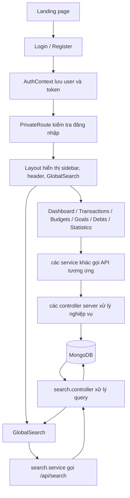

Các Bước Deploy Lên Ngrok
Bước 1: Cài đặt Ngrok
# Tải tại: https://ngrok.com/download
# Hoặc dùng WinGet (Windows)
winget install Ngrok.Ngrok

Bước 2: Cấu hình Ngrok (chỉ làm lần đầu)
ngrok config add-authtoken <YOUR_AUTHTOKEN>
Lấy authtoken tại https://dashboard.ngrok.com/auth

# Project Guide

Tài liệu này giải thích mục đích của các file chính trong dự án và cách luồng app chạy từ đăng nhập đến dashboard, search.

## 1. Folder `client`

### 1.1. File gốc của ứng dụng

- `client/src/main.jsx`: Điểm khởi động React. Render `App` vào DOM và nạp các provider toàn cục.
- `client/src/App.jsx`: Khai báo router chính, bọc các provider và phân luồng trang public/private.
- `client/src/index.css`: CSS toàn cục, reset style và các biến giao diện chung.

### 1.2. Contexts

Các file này giữ state dùng chung cho toàn bộ frontend:

- `client/src/context/AuthContext.jsx`: Quản lý đăng nhập, thông tin user, token, logout và trạng thái xác thực.
- `client/src/context/TransactionContext.jsx`: Quản lý danh sách giao dịch và các thao tác CRUD.
- `client/src/context/CategoryContext.jsx`: Quản lý danh mục chi tiêu/thu nhập.
- `client/src/context/BudgetContext.jsx`: Quản lý ngân sách theo kỳ.
- `client/src/context/GoalContext.jsx`: Quản lý mục tiêu tiết kiệm.
- `client/src/context/DebtContext.jsx`: Quản lý khoản nợ, thanh toán, tất toán và thống kê nợ.
- `client/src/context/ThemeContext.jsx`: Chuyển đổi giao diện sáng/tối.
- `client/src/context/LanguageContext.jsx`: Quản lý ngôn ngữ và chuỗi dịch.

### 1.3. Components dùng lại

- `client/src/components/Layout.jsx`: Khung layout sau khi đăng nhập, gồm sidebar, header, search và vùng nội dung.
- `client/src/components/GlobalSearch.jsx`: Ô tìm kiếm toàn cục, tìm nhanh trong giao dịch, danh mục, ngân sách, mục tiêu và nợ.
- `client/src/components/PrivateRoute.jsx`: Chặn truy cập nếu chưa đăng nhập.
- `client/src/components/PublicRoute.jsx`: Chặn người dùng đã đăng nhập khỏi các trang public như login/register.
- `client/src/components/PageTransition.jsx`: Hiệu ứng chuyển trang.
- `client/src/components/LoadingSkeleton.jsx`: Skeleton loading cho các màn hình khi đang tải dữ liệu.
- `client/src/components/Pagination.jsx`: Component phân trang dùng lại.
- `client/src/components/Tooltip.jsx`: Hiển thị tooltip ngắn gọn cho các biểu tượng/nút.
- `client/src/components/DarkModeToggle.jsx`: Nút bật/tắt dark mode.
- `client/src/components/CurrencyInput.jsx`: Input tiền tệ với định dạng phù hợp.
- `client/src/components/TransactionCalendar.jsx`: Lịch hiển thị giao dịch theo ngày.

### 1.4. Modal / form components

Các file này là form popup để thêm hoặc sửa dữ liệu:

- `client/src/components/TransactionModal.jsx`: Thêm/sửa giao dịch.
- `client/src/components/CategoryModal.jsx`: Thêm/sửa danh mục.
- `client/src/components/BudgetModal.jsx`: Thêm/sửa ngân sách.
- `client/src/components/GoalModal.jsx`: Thêm/sửa mục tiêu.
- `client/src/components/DebtModal.jsx`: Thêm/sửa khoản nợ.
- `client/src/components/ImportModal.jsx`: Nhập dữ liệu từ file hoặc nguồn ngoài.
- `client/src/components/OnboardingModal.jsx`: Modal hướng dẫn người dùng mới.

### 1.5. Pages

- `client/src/pages/Landing.jsx`: Trang giới thiệu/landing page khi chưa đăng nhập.
- `client/src/pages/Login.jsx`: Trang đăng nhập.
- `client/src/pages/Register.jsx`: Trang đăng ký tài khoản.
- `client/src/pages/ForgotPassword.jsx`: Quên mật khẩu.
- `client/src/pages/Dashboard.jsx`: Màn hình tổng quan tài chính, thống kê, dự báo và giao dịch gần đây.
- `client/src/pages/Transactions.jsx`: Quản lý giao dịch.
- `client/src/pages/Categories.jsx`: Quản lý danh mục.
- `client/src/pages/Budgets.jsx`: Quản lý ngân sách.
- `client/src/pages/Goals.jsx`: Quản lý mục tiêu tiết kiệm.
- `client/src/pages/Debts.jsx`: Quản lý công nợ, trả nợ, tất toán.
- `client/src/pages/Statistics.jsx`: Trang biểu đồ và thống kê chuyên sâu.
- `client/src/pages/Profile.jsx`: Thông tin tài khoản, cài đặt người dùng.
- `client/src/pages/Contact.jsx`: Gửi phản hồi/liên hệ.
- `client/src/pages/About.jsx`: Trang giới thiệu dự án.
- `client/src/pages/Privacy.jsx`: Trang chính sách riêng tư.
- `client/src/pages/AdminDashboard.jsx`: Dashboard cho admin.
- `client/src/pages/AdminUsers.jsx`: Quản lý người dùng ở phía admin.
- `client/src/pages/AdminContacts.jsx`: Xử lý các liên hệ từ người dùng.

### 1.6. Services

Các service là lớp gọi API từ frontend sang backend:

- `client/src/services/api.js`: Axios instance, cấu hình base URL, interceptors và token.
- `client/src/services/auth.service.js`: API đăng nhập, đăng ký, refresh token, quên mật khẩu.
- `client/src/services/transaction.service.js`: API cho giao dịch.
- `client/src/services/category.service.js`: API cho danh mục.
- `client/src/services/budget.service.js`: API cho ngân sách.
- `client/src/services/goal.service.js`: API cho mục tiêu.
- `client/src/services/debt.service.js`: API cho quản lý nợ.
- `client/src/services/search.service.js`: API tìm kiếm toàn cục.
- `client/src/services/stats.service.js`: API thống kê, dashboard, dự báo.
- `client/src/services/notification.service.js`: API thông báo.
- `client/src/services/admin.service.js`: API cho trang admin.
- `client/src/services/adminContact.service.js`: API xử lý liên hệ của admin.

### 1.7. Utilities

- `client/src/utils/exportUtils.js`: Hàm xuất dữ liệu ra file hoặc định dạng khác.

### 1.8. Tests

Các file test này kiểm tra UI và hành vi của component:

- `client/src/tests/setup.js`: Cấu hình môi trường test.
- `client/src/tests/components/TransactionModal.test.jsx`: Test modal giao dịch.
- `client/src/tests/components/PrivateRoute.test.jsx`: Test chặn route.
- `client/src/tests/components/Pagination.test.jsx`: Test phân trang.
- `client/src/tests/components/GoalModal.test.jsx`: Test modal mục tiêu.
- `client/src/tests/components/DebtModal.test.jsx`: Test modal nợ.
- `client/src/tests/components/CurrencyInput.test.jsx`: Test input tiền tệ.
- `client/src/tests/components/CategoryModal.test.jsx`: Test modal danh mục.
- `client/src/tests/components/BudgetModal.test.jsx`: Test modal ngân sách.

## 2. Folder `server`

### 2.1. File gốc và cấu hình

- `server/src/index.js`: Điểm khởi động backend, thường là nơi chạy server và kết nối database.
- `server/src/app.js`: Khai báo Express app, middleware, route và error handling.
- `server/src/config/database.js`: Kết nối MongoDB.
- `server/src/utils/sendEmail.js`: Hàm gửi email cho các nghiệp vụ như xác minh, thông báo.

### 2.2. Controllers

Các controller chứa nghiệp vụ xử lý request:

- `server/src/controllers/auth.controller.js`: Đăng ký, đăng nhập, refresh token, quên mật khẩu.
- `server/src/controllers/admin.controller.js`: Nghiệp vụ admin.
- `server/src/controllers/category.controller.js`: CRUD danh mục.
- `server/src/controllers/budget.controller.js`: CRUD ngân sách.
- `server/src/controllers/transaction.controller.js`: CRUD giao dịch, lọc giao dịch.
- `server/src/controllers/goal.controller.js`: CRUD mục tiêu.
- `server/src/controllers/debt.controller.js`: CRUD công nợ, thanh toán, tất toán.
- `server/src/controllers/contact.controller.js`: Xử lý liên hệ từ người dùng.
- `server/src/controllers/import.controller.js`: Import dữ liệu từ file/nguồn ngoài.
- `server/src/controllers/notification.controller.js`: Tạo và quản lý thông báo.
- `server/src/controllers/stats.controller.js`: Thống kê, dashboard, so sánh, dự báo, phân tích.
- `server/src/controllers/search.controller.js`: Tìm kiếm toàn cục và tìm kiếm nâng cao.

### 2.3. Middleware

- `server/src/middleware/auth.middleware.js`: Kiểm tra JWT, gắn `req.user`, và phân quyền theo role.
- `server/src/middleware/error.middleware.js`: Chuẩn hóa lỗi và phản hồi lỗi cho client.

### 2.4. Models

Các schema MongoDB của dự án:

- `server/src/models/User.model.js`: Tài khoản người dùng.
- `server/src/models/Transaction.model.js`: Giao dịch thu/chi.
- `server/src/models/Category.model.js`: Danh mục.
- `server/src/models/Budget.model.js`: Ngân sách.
- `server/src/models/Goal.model.js`: Mục tiêu tài chính.
- `server/src/models/Debt.model.js`: Khoản nợ và lịch sử thanh toán.
- `server/src/models/ContactMessage.model.js`: Tin nhắn liên hệ.
- `server/src/models/Notification.model.js`: Thông báo.

### 2.5. Routes

- `server/src/routes/auth.routes.js`: Route xác thực.
- `server/src/routes/admin.routes.js`: Route cho admin.
- `server/src/routes/category.routes.js`: Route danh mục.
- `server/src/routes/budget.routes.js`: Route ngân sách.
- `server/src/routes/transaction.routes.js`: Route giao dịch.
- `server/src/routes/goal.routes.js`: Route mục tiêu.
- `server/src/routes/debt.routes.js`: Route quản lý nợ.
- `server/src/routes/contact.routes.js`: Route liên hệ.
- `server/src/routes/import.routes.js`: Route import.
- `server/src/routes/notification.routes.js`: Route thông báo.
- `server/src/routes/stats.routes.js`: Route thống kê và dự báo.
- `server/src/routes/search.routes.js`: Route tìm kiếm toàn cục.

## 3. Sơ đồ luồng chạy của app

### Luồng chi tiết

1. Người dùng mở `Landing.jsx`, sau đó chọn đăng nhập hoặc đăng ký.
2. Khi đăng nhập thành công, `AuthContext` lưu thông tin user và token.
3. `PrivateRoute` bảo vệ các trang nội bộ như dashboard, giao dịch, nợ, ngân sách.
4. `Layout` dựng khung chung của app, bao gồm menu, header và ô `GlobalSearch`.
5. Khi mở dashboard, frontend gọi các service như `stats.service`, `transaction.service`, `debt.service` để lấy dữ liệu.
6. Server nhận request, `protect` middleware xác thực JWT trước khi vào controller.
7. `search.controller` hoặc các controller khác truy vấn MongoDB qua model tương ứng.
8. Kết quả trả về frontend, rồi được render thành bảng, biểu đồ, modal hoặc kết quả tìm kiếm.

### Tóm tắt kiến trúc

- Frontend chịu trách nhiệm giao diện, state UI, routing và tương tác người dùng.
- Backend chịu trách nhiệm xác thực, nghiệp vụ, truy vấn dữ liệu và trả JSON.
- MongoDB lưu toàn bộ dữ liệu người dùng và các thực thể tài chính.

## Chức năng import
Import (upload CSV/XLSX):

Files: ImportModal.jsx, api.js (axios wrapper), import.routes.js, import.controller.js, Transaction.model.js, Category.model.js
Luồng: người dùng chọn file → ImportModal gửi POST /api/import/transactions (multipart/form-data) → route dùng upload (multer) → import.controller đọc file (parseCsv / parseExcel), chuẩn hóa header và giá trị, validate từng dòng, ghép category, build mảng bản ghi → Transaction.insertMany(...) → trả JSON tóm tắt (imported / skipped / skippedDetails) → ImportModal hiển thị kết quả và gọi onImported() để refresh UI.
Download mẫu import:

Files: ImportModal.jsx (nút), import.controller.js (getTemplate)
Luồng: client GET /api/import/template → server trả CSV (kèm BOM) với header + vài dòng ví dụ → trình duyệt tải file import_template.csv.
Export (PDF / Excel) — hiện tại thực hiện ở client:

Files: Transactions.jsx, TransactionContext.jsx, transaction.service.js, exportUtils.js, server transaction.controller.js (để lấy dữ liệu)
Luồng: Transactions page (hoặc context) gọi fetchTransactions() → transaction.service.getTransactions() gọi GET /api/transactions → server (getTransactions) trả danh sách giao dịch → client giữ transactions trong TransactionContext → khi người dùng bấm “PDF”/“Excel”, Transactions.jsx gọi exportToPDF(transactions, user) hoặc exportToExcel(...) trong exportUtils.js → file được sinh trên trình duyệt và tải xuống (không cần server).
Hiện trạng / Ghi chú:

Server có endpoint trả CSV chỉ cho template import; không có endpoint streaming CSV export cho toàn bộ dữ liệu (export hiện do client tạo bằng jsPDF / xlsx).
Nếu muốn export server-side (ví dụ: xuất CSV/JSON toàn bộ dữ liệu lớn hoặc có filter server-side), tôi có thể thêm endpoint như GET /api/export/transactions?format=csv|json that streams file via Content-Disposition.