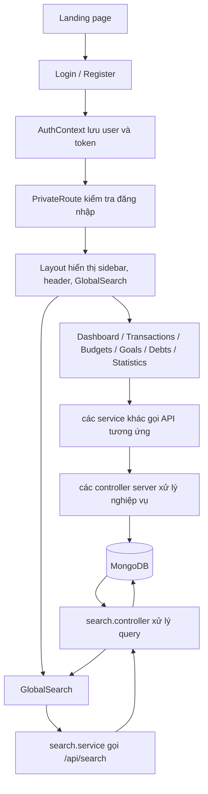

# Project Guide

Tài liệu này giải thích mục đích của các file chính trong dự án và cách luồng app chạy từ đăng nhập đến dashboard, search.

## 1. Folder `client`

### 1.1. File gốc của ứng dụng

- `client/src/main.jsx`: Điểm khởi động React. Render `App` vào DOM và nạp các provider toàn cục.
- `client/src/App.jsx`: Khai báo router chính, bọc các provider và phân luồng trang public/private.
- `client/src/index.css`: CSS toàn cục, reset style và các biến giao diện chung.

### 1.2. Contexts

Các file này giữ state dùng chung cho toàn bộ frontend:

- `client/src/context/AuthContext.jsx`: Quản lý đăng nhập, thông tin user, token, logout và trạng thái xác thực.
- `client/src/context/TransactionContext.jsx`: Quản lý danh sách giao dịch và các thao tác CRUD.
- `client/src/context/CategoryContext.jsx`: Quản lý danh mục chi tiêu/thu nhập.
- `client/src/context/BudgetContext.jsx`: Quản lý ngân sách theo kỳ.
- `client/src/context/GoalContext.jsx`: Quản lý mục tiêu tiết kiệm.
- `client/src/context/DebtContext.jsx`: Quản lý khoản nợ, thanh toán, tất toán và thống kê nợ.
- `client/src/context/ThemeContext.jsx`: Chuyển đổi giao diện sáng/tối.
- `client/src/context/LanguageContext.jsx`: Quản lý ngôn ngữ và chuỗi dịch.

### 1.3. Components dùng lại

- `client/src/components/Layout.jsx`: Khung layout sau khi đăng nhập, gồm sidebar, header, search và vùng nội dung.
- `client/src/components/GlobalSearch.jsx`: Ô tìm kiếm toàn cục, tìm nhanh trong giao dịch, danh mục, ngân sách, mục tiêu và nợ.
- `client/src/components/PrivateRoute.jsx`: Chặn truy cập nếu chưa đăng nhập.
- `client/src/components/PublicRoute.jsx`: Chặn người dùng đã đăng nhập khỏi các trang public như login/register.
- `client/src/components/PageTransition.jsx`: Hiệu ứng chuyển trang.
- `client/src/components/LoadingSkeleton.jsx`: Skeleton loading cho các màn hình khi đang tải dữ liệu.
- `client/src/components/Pagination.jsx`: Component phân trang dùng lại.
- `client/src/components/Tooltip.jsx`: Hiển thị tooltip ngắn gọn cho các biểu tượng/nút.
- `client/src/components/DarkModeToggle.jsx`: Nút bật/tắt dark mode.
- `client/src/components/CurrencyInput.jsx`: Input tiền tệ với định dạng phù hợp.
- `client/src/components/TransactionCalendar.jsx`: Lịch hiển thị giao dịch theo ngày.

### 1.4. Modal / form components

Các file này là form popup để thêm hoặc sửa dữ liệu:

- `client/src/components/TransactionModal.jsx`: Thêm/sửa giao dịch.
- `client/src/components/CategoryModal.jsx`: Thêm/sửa danh mục.
- `client/src/components/BudgetModal.jsx`: Thêm/sửa ngân sách.
- `client/src/components/GoalModal.jsx`: Thêm/sửa mục tiêu.
- `client/src/components/DebtModal.jsx`: Thêm/sửa khoản nợ.
- `client/src/components/ImportModal.jsx`: Nhập dữ liệu từ file hoặc nguồn ngoài.
- `client/src/components/OnboardingModal.jsx`: Modal hướng dẫn người dùng mới.

### 1.5. Pages

- `client/src/pages/Landing.jsx`: Trang giới thiệu/landing page khi chưa đăng nhập.
- `client/src/pages/Login.jsx`: Trang đăng nhập.
- `client/src/pages/Register.jsx`: Trang đăng ký tài khoản.
- `client/src/pages/ForgotPassword.jsx`: Quên mật khẩu.
- `client/src/pages/Dashboard.jsx`: Màn hình tổng quan tài chính, thống kê, dự báo và giao dịch gần đây.
- `client/src/pages/Transactions.jsx`: Quản lý giao dịch.
- `client/src/pages/Categories.jsx`: Quản lý danh mục.
- `client/src/pages/Budgets.jsx`: Quản lý ngân sách.
- `client/src/pages/Goals.jsx`: Quản lý mục tiêu tiết kiệm.
- `client/src/pages/Debts.jsx`: Quản lý công nợ, trả nợ, tất toán.
- `client/src/pages/Statistics.jsx`: Trang biểu đồ và thống kê chuyên sâu.
- `client/src/pages/Profile.jsx`: Thông tin tài khoản, cài đặt người dùng.
- `client/src/pages/Contact.jsx`: Gửi phản hồi/liên hệ.
- `client/src/pages/About.jsx`: Trang giới thiệu dự án.
- `client/src/pages/Privacy.jsx`: Trang chính sách riêng tư.
- `client/src/pages/AdminDashboard.jsx`: Dashboard cho admin.
- `client/src/pages/AdminUsers.jsx`: Quản lý người dùng ở phía admin.
- `client/src/pages/AdminContacts.jsx`: Xử lý các liên hệ từ người dùng.

### 1.6. Services

Các service là lớp gọi API từ frontend sang backend:

- `client/src/services/api.js`: Axios instance, cấu hình base URL, interceptors và token.
- `client/src/services/auth.service.js`: API đăng nhập, đăng ký, refresh token, quên mật khẩu.
- `client/src/services/transaction.service.js`: API cho giao dịch.
- `client/src/services/category.service.js`: API cho danh mục.
- `client/src/services/budget.service.js`: API cho ngân sách.
- `client/src/services/goal.service.js`: API cho mục tiêu.
- `client/src/services/debt.service.js`: API cho quản lý nợ.
- `client/src/services/search.service.js`: API tìm kiếm toàn cục.
- `client/src/services/stats.service.js`: API thống kê, dashboard, dự báo.
- `client/src/services/notification.service.js`: API thông báo.
- `client/src/services/admin.service.js`: API cho trang admin.
- `client/src/services/adminContact.service.js`: API xử lý liên hệ của admin.

### 1.7. Utilities

- `client/src/utils/exportUtils.js`: Hàm xuất dữ liệu ra file hoặc định dạng khác.

### 1.8. Tests

Các file test này kiểm tra UI và hành vi của component:

- `client/src/tests/setup.js`: Cấu hình môi trường test.
- `client/src/tests/components/TransactionModal.test.jsx`: Test modal giao dịch.
- `client/src/tests/components/PrivateRoute.test.jsx`: Test chặn route.
- `client/src/tests/components/Pagination.test.jsx`: Test phân trang.
- `client/src/tests/components/GoalModal.test.jsx`: Test modal mục tiêu.
- `client/src/tests/components/DebtModal.test.jsx`: Test modal nợ.
- `client/src/tests/components/CurrencyInput.test.jsx`: Test input tiền tệ.
- `client/src/tests/components/CategoryModal.test.jsx`: Test modal danh mục.
- `client/src/tests/components/BudgetModal.test.jsx`: Test modal ngân sách.

## 2. Folder `server`

### 2.1. File gốc và cấu hình

- `server/src/index.js`: Điểm khởi động backend, thường là nơi chạy server và kết nối database.
- `server/src/app.js`: Khai báo Express app, middleware, route và error handling.
- `server/src/config/database.js`: Kết nối MongoDB.
- `server/src/utils/sendEmail.js`: Hàm gửi email cho các nghiệp vụ như xác minh, thông báo.

### 2.2. Controllers

Các controller chứa nghiệp vụ xử lý request:

- `server/src/controllers/auth.controller.js`: Đăng ký, đăng nhập, refresh token, quên mật khẩu.
- `server/src/controllers/admin.controller.js`: Nghiệp vụ admin.
- `server/src/controllers/category.controller.js`: CRUD danh mục.
- `server/src/controllers/budget.controller.js`: CRUD ngân sách.
- `server/src/controllers/transaction.controller.js`: CRUD giao dịch, lọc giao dịch.
- `server/src/controllers/goal.controller.js`: CRUD mục tiêu.
- `server/src/controllers/debt.controller.js`: CRUD công nợ, thanh toán, tất toán.
- `server/src/controllers/contact.controller.js`: Xử lý liên hệ từ người dùng.
- `server/src/controllers/import.controller.js`: Import dữ liệu từ file/nguồn ngoài.
- `server/src/controllers/notification.controller.js`: Tạo và quản lý thông báo.
- `server/src/controllers/stats.controller.js`: Thống kê, dashboard, so sánh, dự báo, phân tích.
- `server/src/controllers/search.controller.js`: Tìm kiếm toàn cục và tìm kiếm nâng cao.

### 2.3. Middleware

- `server/src/middleware/auth.middleware.js`: Kiểm tra JWT, gắn `req.user`, và phân quyền theo role.
- `server/src/middleware/error.middleware.js`: Chuẩn hóa lỗi và phản hồi lỗi cho client.

### 2.4. Models

Các schema MongoDB của dự án:

- `server/src/models/User.model.js`: Tài khoản người dùng.
- `server/src/models/Transaction.model.js`: Giao dịch thu/chi.
- `server/src/models/Category.model.js`: Danh mục.
- `server/src/models/Budget.model.js`: Ngân sách.
- `server/src/models/Goal.model.js`: Mục tiêu tài chính.
- `server/src/models/Debt.model.js`: Khoản nợ và lịch sử thanh toán.
- `server/src/models/ContactMessage.model.js`: Tin nhắn liên hệ.
- `server/src/models/Notification.model.js`: Thông báo.

### 2.5. Routes

- `server/src/routes/auth.routes.js`: Route xác thực.
- `server/src/routes/admin.routes.js`: Route cho admin.
- `server/src/routes/category.routes.js`: Route danh mục.
- `server/src/routes/budget.routes.js`: Route ngân sách.
- `server/src/routes/transaction.routes.js`: Route giao dịch.
- `server/src/routes/goal.routes.js`: Route mục tiêu.
- `server/src/routes/debt.routes.js`: Route quản lý nợ.
- `server/src/routes/contact.routes.js`: Route liên hệ.
- `server/src/routes/import.routes.js`: Route import.
- `server/src/routes/notification.routes.js`: Route thông báo.
- `server/src/routes/stats.routes.js`: Route thống kê và dự báo.
- `server/src/routes/search.routes.js`: Route tìm kiếm toàn cục.

## 3. Sơ đồ luồng chạy của app

### Luồng chi tiết

1. Người dùng mở `Landing.jsx`, sau đó chọn đăng nhập hoặc đăng ký.
2. Khi đăng nhập thành công, `AuthContext` lưu thông tin user và token.
3. `PrivateRoute` bảo vệ các trang nội bộ như dashboard, giao dịch, nợ, ngân sách.
4. `Layout` dựng khung chung của app, bao gồm menu, header và ô `GlobalSearch`.
5. Khi mở dashboard, frontend gọi các service như `stats.service`, `transaction.service`, `debt.service` để lấy dữ liệu.
6. Server nhận request, `protect` middleware xác thực JWT trước khi vào controller.
7. `search.controller` hoặc các controller khác truy vấn MongoDB qua model tương ứng.
8. Kết quả trả về frontend, rồi được render thành bảng, biểu đồ, modal hoặc kết quả tìm kiếm.

### Tóm tắt kiến trúc

- Frontend chịu trách nhiệm giao diện, state UI, routing và tương tác người dùng.
- Backend chịu trách nhiệm xác thực, nghiệp vụ, truy vấn dữ liệu và trả JSON.
- MongoDB lưu toàn bộ dữ liệu người dùng và các thực thể tài chính.

## 4. Chi tiết các chức năng chính

### 4.1 Import Dữ Liệu (CSV/Excel)

| Tiêu chí | Chi tiết |
|---------|---------|
| **Mô tả** | Cho phép người dùng upload file CSV/Excel để import danh sách giao dịch hàng loạt vào hệ thống |
| **Luồng chính** | 1. User chọn file CSV/Excel ở `ImportModal` 2. Client gửi POST `/api/import/transactions` (multipart/form-data) 3. Server: `multer` nhận file → `parseCsv`/`parseExcel` đọc dữ liệu 4. Chuẩn hóa header (date, type, amount, category, note) 5. Validate từng dòng (date, type, amount, category) 6. Ghép category từ user's categories 7. `Transaction.insertMany()` lưu vào DB 8. Trả kết quả (imported, skipped, error details) 9. Client hiển thị tóm tắt kết quả |

| **Frontend Files** | - `client/src/components/ImportModal.jsx` (UI upload + kết quả) - `client/src/services/api.js` (axios wrapper) - `client/src/context/TransactionContext.jsx` (refresh data) |
| **Backend Files** | - `server/src/routes/import.routes.js` (POST /import/transactions) - `server/src/controllers/import.controller.js` (xử lý logic) - `server/src/models/Transaction.model.js` (schema) - `server/src/models/Category.model.js` (ghép category) |

| **Thư viện** | **Server:** multer, csv-parse, xlsx **Client:** axios, FormData (native), react-toastify |
| **Endpoint API** | `POST /api/import/transactions` (multipart/form-data) `GET /api/import/template` (tải mẫu CSV) |

---

### 4.2 Tìm Kiếm Nâng Cao (Advanced Search)

| Tiêu chí | Chi tiết |
|---------|---------|
| **Mô tả** | Lọc giao dịch theo nhiều tiêu chí: loại (thu/chi), danh mục, khoảng ngày, khoảng số tiền |
| **Luồng chính** | 1. User mở bộ lọc nâng cao trên trang `Transactions` 2. Nhập: danh mục, ngày từ-đến, số tiền từ-đến 3. Debounce 500ms để tránh gọi API quá nhiều 4. Client gửi GET `/api/transactions` với params filter 5. Server: `search.controller` build MongoDB query 6. Query conditions: category ($regex), date ($gte/$lte), amount ($gte/$lte) 7. Kết quả phân trang trả về 8. UI hiển thị kết quả và số lượng kết quả |

| **Frontend Files** | - `client/src/pages/Transactions.jsx` (UI filter + display) - `client/src/services/transaction.service.js` (API call) - `client/src/context/TransactionContext.jsx` (state) |
| **Backend Files** | - `server/src/routes/transaction.routes.js` (GET /transactions) - `server/src/controllers/transaction.controller.js` (getTransactions) - `server/src/models/Transaction.model.js` (schema) |

| **Thư viện** | **Client:** axios, useCallback, useRef (debounce) **Server:** mongoose, express |
| **Endpoint API** | `GET /api/transactions?category=...&type=...&startDate=...&endDate=...&amountMin=...&amountMax=...&page=...&limit=...` |

---

### 4.3 Tìm Kiếm Toàn Cục (Global Search)

| Tiêu chí | Chi tiết |
|---------|---------|
| **Mô tả** | Tìm kiếm nhanh trong tất cả entity: giao dịch, danh mục, ngân sách, mục tiêu, nợ, người dùng |
| **Luồng chính** | 1. User nhập query vào ô `GlobalSearch` ở header 2. Debounce 300ms 3. Client gửi POST `/api/search` với query 4. Server: `search.controller.globalSearch()` chạy aggregation 5. Tìm trong: Transaction, Category, Budget, Goal, Debt, User 6. Kết quả nhóm theo loại entity 7. Trả JSON danh sách kết quả 8. Client hiển thị dropdown kết quả (max 5 item/type) 9. Click item → navigate đến detail/edit modal |
| **Frontend Files** | - `client/src/components/GlobalSearch.jsx` (UI + logic) - `client/src/services/search.service.js` (API call) - `client/src/context/*Context.jsx` (data sources) |
| **Backend Files** | - `server/src/routes/search.routes.js` (POST /search) - `server/src/controllers/search.controller.js` (globalSearch) - `server/src/models/Transaction.model.js`, Category, Budget, Goal, Debt, User |
| **Thư viện** | **Client:** axios, useRef (debounce), React hooks **Server:** mongoose aggregation, express |
| **Endpoint API** | `POST /api/search` (body: { query: string }) `GET /api/search/suggestions` (autocomplete suggestions) |

---

### 4.4 Thông Báo (Notifications)

| Tiêu chí | Chi tiết |
|---------|---------|
| **Mô tả** | Hệ thống thông báo: giao dịch lớn, cảnh báo ngân sách, đạt mục tiêu, nhắc trả nợ |
| **Luồng chính** | 1. Khi tạo giao dịch: nếu > 1M đ → tạo notification 2. Khi check ngân sách: nếu vượt 80-100% → tạo cảnh báo 3. Khi mục tiêu đạt 100% → thông báo thành công 4. Khi nợ sắp hết hạn → nhắc thanh toán 5. Server: `notification.controller` lưu vào DB 6. Client: fetch `/api/notifications` định kỳ 7. UI hiển thị badge và danh sách thông báo 8. User có thể đánh dấu đã đọc hoặc xóa |
| **Frontend Files** | - `client/src/context/NotificationContext.jsx` (manage state) - `client/src/services/notification.service.js` (API call) - UI component hiển thị notification badge |
| **Backend Files** | - `server/src/routes/notification.routes.js` - `server/src/controllers/notification.controller.js` (CRUD) - `server/src/models/Notification.model.js` (schema) - Logic trigger ở `transaction.controller`, `budget.controller` |
| **Thư viện** | **Server:** mongoose, express **Client:** axios, React hooks |
| **Endpoint API** | `GET /api/notifications` `PUT /api/notifications/:id/read` `DELETE /api/notifications/:id` |

---

### 4.5 Dự Báo Chi Tiêu (SES + SMA)

| Tiêu chí | Chi tiết |
|---------|---------|
| **Mô tả** | Dự báo chi tiêu tháng tiếp theo dùng Single Exponential Smoothing (SES) + Simple Moving Average (SMA) |
| **Luồng chính** | 1. User xem Dashboard → thẻ "Forecast" 2. Client gọi GET `/api/stats/forecast` 3. Server: `stats.controller.forecastSpending()` 4. Lấy lịch sử 12 tháng chi tiêu theo category 5. Tính SES (α=0.4) cho overall expense/income 6. Tính SMA (window=3) cho từng category 7. Fallback: nếu không đủ data, dùng trung bình 8. Trả: forecastExpense, forecastIncome, byCategory 9. Client hiển thị kết quả so sánh |
| **Frontend Files** | - `client/src/pages/Dashboard.jsx` (hiển thị forecast card) - `client/src/services/stats.service.js` (API call) |
| **Backend Files** | - `server/src/routes/stats.routes.js` (GET /forecast) - `server/src/controllers/stats.controller.js` - `server/src/services/xgboost.forecast.service.js`   - XGBoost-style Weighted Ensemble (6 weak learners) - `server/src/models/Transaction.model.js` (aggregation) |
| **Thư viện** | **Server:** mongoose **Client:** axios, chart libraries |
| **Endpoint API** | `GET /api/stats/forecast?startDate=...&endDate=...` |
| **Công thức** | **SES:** ŷ(t+1) = α·y(t) + (1-α)·ŷ(t) **SMA:** SMA(n) = (1/n)·Σy(t-i) |

---

### 4.6 Cảnh Báo Ngân Sách (Budget Alerts)

| Tiêu chí | Chi tiết |
|---------|---------|
| **Mô tả** | Cảnh báo khi chi tiêu vượt ngân sách hoặc đạt 80%/100% |
| **Luồng chính** | 1. User tạo ngân sách ở `BudgetModal` 2. Khi tạo giao dịch chi: call `checkBudgetAndNotify()` 3. Tính tổng chi tiêu trong kỳ (period: weekly/monthly/yearly) 4. Tính percentage: (currentSpending / budgetAmount) * 100 5. Nếu >= 80%: tạo warning notification 6. Nếu >= 100%: tạo error notification (vượt) 7. Deduplicate: check thông báo trong 24h 8. Lưu metadata (budgetId, category, percentage) 9. Client hiển thị progress bar trên ngân sách |
| **Frontend Files** | - `client/src/pages/Budgets.jsx` (UI) - `client/src/components/BudgetModal.jsx` (tạo/sửa) - `client/src/context/BudgetContext.jsx` (state) |
| **Backend Files** | - `server/src/controllers/budget.controller.js` (CRUD) - `server/src/controllers/transaction.controller.js` (trigger alert) - `server/src/models/Budget.model.js` (schema) - `server/src/models/Notification.model.js` (save alert) |
| **Thư viện** | **Server:** mongoose, moment **Client:** axios |
| **Endpoint API** | `GET /api/budgets` `POST /api/budgets` `GET /api/budgets/:id/status` |

---

### 4.7 Rollover / Auto Repeat Ngân Sách

| Tiêu chí | Chi tiết |
|---------|---------|
| **Mô tả** | Tự động rollover ngân sách hàng tuần/tháng/năm |
| **Luồng chính** | 1. User tạo budget với period (weekly/monthly/yearly) 2. Server: Khi fetch budgets, check `startDate` vs `period` 3. Nếu kỳ hiện tại khác kỳ trước → rollover 4. Reset spending về 0 hoặc giữ nguyên 5. Tạo record mới hoặc update existing 6. Client hiển thị lịch sử các kỳ 7. User có thể manual reset hoặc enable auto |
| **Frontend Files** | - `client/src/components/BudgetModal.jsx` (auto-rollover option) - `client/src/pages/Budgets.jsx` (history) - `client/src/context/BudgetContext.jsx` |
| **Backend Files** | - `server/src/controllers/budget.controller.js` (rollover logic) - `server/src/models/Budget.model.js` (startDate, period) |
| **Thư viện** | **Server:** mongoose, date-fns/moment **Client:** axios |
| **Endpoint API** | `POST /api/budgets/:id/rollover` `GET /api/budgets?period=monthly` |

---

### 4.8 Đăng Nhập Bằng Google (OAuth 2.0)

| Tiêu chí | Chi tiết |
|---------|---------|
| **Mô tả** | Đăng nhập/đăng ký dùng tài khoản Google |
| **Luồng chính** | 1. User bấm "Login with Google" ở `Landing`/`Login` 2. Client: Google OAuth popup 3. User chọn Google account 4. Google trả `idToken` (JWT) 5. Client POST `/api/auth/google` với `idToken` 6. Server: verify token qua Google API 7. Extract email, name, picture 8. Tìm/tạo user trong DB 9. Generate JWT token & refresh token 10. Trả user info & tokens 11. Client lưu token → redirect Dashboard |
| **Frontend Files** | - `client/src/pages/Landing.jsx` (nút Google) - `client/src/pages/Login.jsx` (nút Google) - `client/src/services/auth.service.js` (googleLogin API) - `client/src/context/AuthContext.jsx` |
| **Backend Files** | - `server/src/routes/auth.routes.js` (POST /google) - `server/src/controllers/auth.controller.js` (googleLogin) - `server/src/models/User.model.js` (findOrCreate) |
| **Thư viện** | **Client:** @react-oauth/google **Server:** google-auth-library, jsonwebtoken |
| **Endpoint API** | `POST /api/auth/google` (body: { idToken }) |

---

### 4.9 Quên Mật Khẩu (Forgot Password)

| Tiêu chí | Chi tiết |
|---------|---------|
| **Mô tả** | Reset mật khẩu qua link xác thực trong email |
| **Luồng chính** | 1. User mở `ForgotPassword` → nhập email 2. Client POST `/api/auth/forgot-password` 3. Server: tìm user → generate reset token 4. Lưu `resetPasswordToken` + `resetPasswordExpire` (15min) 5. Gửi email chứa link: `/reset-password/{token}` 6. User click link → mở form reset password 7. Nhập password mới → POST `/api/auth/reset-password` 8. Server: verify token, update password (bcrypt) 9. Clear token → user login lại 10. Client hiển thị success message |
| **Frontend Files** | - `client/src/pages/ForgotPassword.jsx` (form request) - `client/src/services/auth.service.js` (API calls) - Route `/reset-password/:token` (reset form) |
| **Backend Files** | - `server/src/controllers/auth.controller.js`   - `forgotPassword()` (send email)   - `resetPassword()` (update password) - `server/src/utils/sendEmail.js` (sendResetPasswordEmail) - `server/src/models/User.model.js` (token fields) |
| **Thư viện** | **Server:** nodemailer, bcryptjs, crypto **Client:** axios, react-router |
| **Endpoint API** | `POST /api/auth/forgot-password` (body: { email }) `POST /api/auth/reset-password` (body: { token, newPassword }) |

---

### 4.10 Đăng Nhập (Login)

| Tiêu chí | Chi tiết |
|---------|---------|
| **Mô tả** | Xác thực user bằng email/password, cấp JWT token |
| **Luồng chính** | 1. User mở `Login` → nhập email, password 2. Client POST `/api/auth/login` 3. Server: tìm user by email 4. Compare password (bcrypt) 5. Nếu đúng: generate JWT (access + refresh) 6. Lưu refresh token vào DB/cookie 7. Trả user info + tokens 8. Client lưu token → localStorage 9. AuthContext lưu user state 10. PrivateRoute check → redirect Dashboard 11. API requests gửi `Authorization: Bearer {token}` |
| **Frontend Files** | - `client/src/pages/Login.jsx` (form) - `client/src/services/auth.service.js` (login API) - `client/src/context/AuthContext.jsx` (save token/user) - `client/src/services/api.js` (interceptor) |
| **Backend Files** | - `server/src/controllers/auth.controller.js` (login logic) - `server/src/models/User.model.js` (comparePassword) - `server/src/middleware/auth.middleware.js` (verify JWT) |
| **Thư viện** | **Server:** express, bcryptjs, jsonwebtoken **Client:** axios, react-router |
| **Endpoint API** | `POST /api/auth/login` (body: { email, password }) `POST /api/auth/refresh` (refresh token) |

---

### 4.11 Dark Mode (Chế độ tối)

| Tiêu chí | Chi tiết |
|---------|---------|
| **Mô tả** | Chuyển đổi giữa giao diện sáng/tối, lưu cài đặt |
| **Luồng chính** | 1. User bấm nút `DarkModeToggle` ở header 2. Client: toggle state ở `ThemeContext` 3. Thêm class `dark` vào root element 4. CSS (Tailwind) render dark theme 5. Lưu preference vào localStorage 6. Nếu user có account: PUT `/api/user/theme` 7. Lần load sau: check DB/localStorage → apply theme |
| **Frontend Files** | - `client/src/context/ThemeContext.jsx` (manage theme) - `client/src/components/DarkModeToggle.jsx` (toggle) - `client/src/index.css` (Tailwind dark classes) - `client/src/App.jsx` (ThemeProvider) |
| **Backend Files** | - `server/src/controllers/auth.controller.js` (updateProfile theme) - `server/src/models/User.model.js` (theme field) |
| **Thư viện** | **Client:** React Context, localStorage, Tailwind CSS **Server:** mongoose |
| **Endpoint API** | `PUT /api/user/theme` (body: { theme: 'light'|'dark' }) |

---

### 4.12 Đổi Ngôn Ngữ (Language Switching)

| Tiêu chí | Chi tiết |
|---------|---------|
| **Mô tả** | Chuyển đổi ngôn ngữ (Tiếng Việt / English), lưu cài đặt |
| **Luồng chính** | 1. User chọn ngôn ngữ từ dropdown ở header 2. Client: update state ở `LanguageContext` 3. Re-render UI dùng key dịch từ object 4. Lưu `language` vào localStorage 5. Nếu user có account: PUT `/api/user/language` 6. Lần load sau: check DB/localStorage → apply 7. Tất cả UI dùng `t(key)` hook từ LanguageContext |
| **Frontend Files** | - `client/src/context/LanguageContext.jsx` (manage language + translations) - Tất cả pages/components: import `useLanguage()` → dùng `t(key)` - `client/src/App.jsx` (LanguageProvider) |
| **Backend Files** | - `server/src/controllers/auth.controller.js` (updateProfile language) - `server/src/models/User.model.js` (language field) |
| **Thư viện** | **Client:** React Context, localStorage **Server:** mongoose **Alternative:** i18next (scaling) |
| **Endpoint API** | `PUT /api/user/language` (body: { language: 'vi'|'en' }) |
| **Ghi chú** | Translation object nên tách thành file riêng (`translations.json`) |

---

### 4.13 Quản Lý Giao Dịch (Transaction CRUD)

| Tiêu chí | Chi tiết |
|---------|---------|
| **Mô tả** | Thêm, sửa, xóa và xem danh sách giao dịch thu/chi, hỗ trợ lọc và phân trang |
| **Luồng thêm giao dịch** | 1. User bấm nút "Thêm giao dịch" ở trang `Transactions` hoặc `Dashboard` 2. `TransactionModal` hiện ra với form: loại (thu/chi), số tiền, danh mục, ngày, ghi chú 3. User nhập `CurrencyInput` (tự định dạng số), chọn category từ dropdown 4. Submit → `TransactionContext.addTransaction()` gọi `transaction.service.create()` 5. Client POST `/api/transactions` với body `{ type, amount, category, date, note }` 6. Server: `auth.middleware` xác thực JWT → `transaction.controller.createTransaction()` 7. Validate dữ liệu → lưu `Transaction.create()` vào MongoDB 8. Trigger `checkBudgetAndNotify()` nếu là giao dịch chi 9. Trả transaction mới → Client cập nhật state và đóng modal |
| **Luồng sửa/xóa** | 1. User click vào giao dịch → `TransactionModal` mở ở chế độ edit 2. Sửa các trường → Submit → PUT `/api/transactions/:id` 3. Server update → trả transaction đã cập nhật 4. Xóa: User click icon xóa → confirm dialog → DELETE `/api/transactions/:id` 5. `TransactionContext` xóa khỏi state sau khi server trả 200 |
| **Frontend Files** | - `client/src/pages/Transactions.jsx` (danh sách, lọc, phân trang) - `client/src/components/TransactionModal.jsx` (form thêm/sửa) - `client/src/components/CurrencyInput.jsx` (nhập tiền tệ) - `client/src/components/TransactionCalendar.jsx` (xem theo lịch) - `client/src/components/Pagination.jsx` (phân trang) - `client/src/context/TransactionContext.jsx` (state toàn cục) - `client/src/services/transaction.service.js` (gọi API) |
| **Backend Files** | - `server/src/routes/transaction.routes.js` (GET/POST/PUT/DELETE) - `server/src/controllers/transaction.controller.js` (CRUD + filter) - `server/src/models/Transaction.model.js` (schema: type, amount, category, date, note, userId) - `server/src/middleware/auth.middleware.js` (bảo vệ route) |
| **Thư viện** | **Server:** mongoose, express **Client:** axios, react-toastify, date-fns |
| **Endpoint API** | `GET /api/transactions?page=...&limit=...&type=...&category=...` `POST /api/transactions` `PUT /api/transactions/:id` `DELETE /api/transactions/:id` |

---

### 4.14 Quản Lý Ngân Sách (Budget CRUD)

| Tiêu chí | Chi tiết |
|---------|---------|
| **Mô tả** | Tạo, sửa, xóa ngân sách theo kỳ (tuần/tháng/năm), theo dõi tiến độ chi tiêu so với ngân sách |
| **Luồng tạo ngân sách** | 1. User mở trang `Budgets` → bấm "Thêm ngân sách" 2. `BudgetModal` hiện: chọn category, nhập limit, chọn period (weekly/monthly/yearly), bật auto-rollover 3. Submit → `BudgetContext.addBudget()` → `budget.service.create()` 4. Client POST `/api/budgets` với body `{ category, amount, period, startDate, autoRollover }` 5. Server: `budget.controller.createBudget()` → `Budget.create()` → lưu MongoDB 6. Client nhận budget mới → hiển thị progress bar (0%) |
| **Luồng theo dõi tiến độ** | 1. Client fetch GET `/api/budgets` → danh sách budgets 2. Server tính `currentSpending` = tổng giao dịch chi trong kỳ hiện tại theo category 3. Tính `percentage = (currentSpending / amount) * 100` 4. Trả về `{ ...budget, currentSpending, percentage }` 5. Client render progress bar màu (xanh < 80%, vàng 80–99%, đỏ ≥ 100%) |
| **Frontend Files** | - `client/src/pages/Budgets.jsx` (danh sách + progress bar) - `client/src/components/BudgetModal.jsx` (form tạo/sửa) - `client/src/context/BudgetContext.jsx` (state) - `client/src/services/budget.service.js` (API) |
| **Backend Files** | - `server/src/routes/budget.routes.js` - `server/src/controllers/budget.controller.js` (CRUD + tính spending) - `server/src/models/Budget.model.js` (category, amount, period, startDate, autoRollover) - `server/src/models/Transaction.model.js` (aggregation tính spending) |
| **Thư viện** | **Server:** mongoose, moment/date-fns **Client:** axios, react-toastify |
| **Endpoint API** | `GET /api/budgets` `POST /api/budgets` `PUT /api/budgets/:id` `DELETE /api/budgets/:id` `GET /api/budgets/:id/status` |

---

### 4.15 Quản Lý Mục Tiêu Tiết Kiệm (Goal CRUD)

| Tiêu chí | Chi tiết |
|---------|---------|
| **Mô tả** | Tạo mục tiêu tiết kiệm có deadline, theo dõi tiến độ, nhận thông báo khi hoàn thành |
| **Luồng tạo mục tiêu** | 1. User mở trang `Goals` → bấm "Thêm mục tiêu" 2. `GoalModal` hiện: tên mục tiêu, số tiền cần đạt, ngày mục tiêu, mô tả 3. Submit → `GoalContext.addGoal()` → `goal.service.create()` 4. Client POST `/api/goals` với `{ name, targetAmount, targetDate, description }` 5. Server: `goal.controller.createGoal()` → `Goal.create()` → lưu MongoDB |
| **Luồng cập nhật tiến độ** | 1. User bấm "Thêm tiền vào mục tiêu" trên card Goal 2. Nhập số tiền muốn góp → `GoalContext.updateGoal()` 3. PUT `/api/goals/:id` với `{ currentAmount: newTotal }` 4. Server update → nếu `currentAmount >= targetAmount`: trigger notification "Đạt mục tiêu!" 5. Client hiển thị confetti + thông báo thành công 6. Tính `percentage = (currentAmount / targetAmount) * 100` → cập nhật progress bar |
| **Frontend Files** | - `client/src/pages/Goals.jsx` (grid card mục tiêu + progress) - `client/src/components/GoalModal.jsx` (form tạo/sửa) - `client/src/context/GoalContext.jsx` (state) - `client/src/services/goal.service.js` (API) |
| **Backend Files** | - `server/src/routes/goal.routes.js` - `server/src/controllers/goal.controller.js` (CRUD + check completion) - `server/src/models/Goal.model.js` (name, targetAmount, currentAmount, targetDate, userId) - `server/src/models/Notification.model.js` (lưu thông báo hoàn thành) |
| **Thư viện** | **Server:** mongoose, express **Client:** axios, react-toastify |
| **Endpoint API** | `GET /api/goals` `POST /api/goals` `PUT /api/goals/:id` `DELETE /api/goals/:id` |

---

### 4.16 Quản Lý Công Nợ (Debt CRUD)

| Tiêu chí | Chi tiết |
|---------|---------|
| **Mô tả** | Quản lý các khoản nợ (vay/cho vay), lịch sử thanh toán, tất toán và nhắc nhở trả nợ |
| **Luồng tạo khoản nợ** | 1. User mở trang `Debts` → bấm "Thêm khoản nợ" 2. `DebtModal` hiện: loại (mình nợ/người nợ mình), tên người liên quan, số tiền, lãi suất, ngày đến hạn, mô tả 3. Submit → `DebtContext.addDebt()` → `debt.service.create()` 4. Client POST `/api/debts` với `{ type, lenderBorrower, principal, interestRate, dueDate, description }` 5. Server: `debt.controller.createDebt()` → `Debt.create()` → lưu MongoDB |
| **Luồng thanh toán** | 1. User bấm "Thanh toán" trên card khoản nợ 2. Nhập số tiền thanh toán và ngày → `debt.service.addPayment()` 3. POST `/api/debts/:id/payment` với `{ amount, date, note }` 4. Server: lưu payment vào mảng `payments` trong Debt document 5. Tính `remainingAmount = principal - totalPaid` 6. Nếu `remainingAmount <= 0`: tự động đánh dấu `status = 'settled'` 7. Client cập nhật UI: hiển thị lịch sử thanh toán + số dư còn lại |
| **Luồng tất toán thủ công** | 1. User bấm "Tất toán" → confirm dialog 2. PUT `/api/debts/:id` với `{ status: 'settled' }` 3. Server update → trả debt đã cập nhật 4. Client chuyển card sang tab "Đã tất toán" |
| **Frontend Files** | - `client/src/pages/Debts.jsx` (tab: đang nợ / đã tất toán, thống kê tổng nợ) - `client/src/components/DebtModal.jsx` (form tạo/sửa) - `client/src/context/DebtContext.jsx` (state + thống kê) - `client/src/services/debt.service.js` (API) |
| **Backend Files** | - `server/src/routes/debt.routes.js` - `server/src/controllers/debt.controller.js` (CRUD + payment + settle) - `server/src/models/Debt.model.js` (principal, interestRate, dueDate, payments[], status, userId) - `server/src/models/Notification.model.js` (nhắc đến hạn) |
| **Thư viện** | **Server:** mongoose, moment/date-fns **Client:** axios, react-toastify |
| **Endpoint API** | `GET /api/debts` `POST /api/debts` `PUT /api/debts/:id` `DELETE /api/debts/:id` `POST /api/debts/:id/payment` `PUT /api/debts/:id/settle` |

---

### 4.17 Dashboard Tổng Quan

| Tiêu chí | Chi tiết |
|---------|---------|
| **Mô tả** | Màn hình tổng hợp tình hình tài chính: số dư, thu/chi tháng, biểu đồ, giao dịch gần đây, dự báo |
| **Luồng tải Dashboard** | 1. User đăng nhập thành công → `PrivateRoute` redirect đến `/dashboard` 2. `Dashboard.jsx` mount → gọi song song 4 API:   - `stats.service.getSummary()` → GET `/api/stats/summary` (tổng thu, chi, số dư tháng này)   - `stats.service.getChartData()` → GET `/api/stats/chart` (dữ liệu biểu đồ 6 tháng)   - `transaction.service.getRecent()` → GET `/api/transactions?limit=5` (giao dịch gần đây)   - `stats.service.getForecast()` → GET `/api/stats/forecast` (dự báo tháng tới) 3. Server xử lý từng request → aggregate MongoDB 4. `LoadingSkeleton` hiển thị trong khi chờ data 5. Data về → render: thẻ tóm tắt, biểu đồ thu/chi, danh sách giao dịch, thẻ dự báo |
| **Các thẻ trên Dashboard** | - **Số dư hiện tại**: tổng thu - tổng chi toàn thời gian - **Thu tháng này / Chi tháng này**: aggregate theo tháng hiện tại - **Biểu đồ cột**: thu vs chi 6 tháng gần nhất - **Biểu đồ tròn**: phân bổ chi tiêu theo danh mục - **Giao dịch gần đây**: 5 giao dịch mới nhất - **Dự báo**: SES + SMA tháng tới |
| **Frontend Files** | - `client/src/pages/Dashboard.jsx` (layout + fetch + render) - `client/src/components/LoadingSkeleton.jsx` (loading state) - `client/src/services/stats.service.js` (summary, chart, forecast) - `client/src/services/transaction.service.js` (recent transactions) |
| **Backend Files** | - `server/src/routes/stats.routes.js` (GET /summary, /chart, /forecast) - `server/src/controllers/stats.controller.js` (aggregate logic) - `server/src/models/Transaction.model.js` (aggregation pipeline) - `server/src/middleware/auth.middleware.js` (protect) |
| **Thư viện** | **Server:** mongoose aggregation pipeline **Client:** axios, recharts/chart.js (biểu đồ), Promise.all |
| **Endpoint API** | `GET /api/stats/summary?month=...&year=...` `GET /api/stats/chart?months=6` `GET /api/stats/forecast` `GET /api/transactions?limit=5&sort=-date` |

---

### 4.18 Thống Kê Nâng Cao (Statistics)

| Tiêu chí | Chi tiết |
|---------|---------|
| **Mô tả** | Phân tích chuyên sâu: so sánh kỳ, phân tích danh mục, xu hướng, top chi tiêu |
| **Luồng xem thống kê** | 1. User mở trang `Statistics` → chọn khoảng thời gian (date range picker) 2. Client gọi GET `/api/stats/analysis?startDate=...&endDate=...` 3. Server: `stats.controller.getAnalysis()` chạy nhiều aggregation:   - Tổng thu/chi theo ngày trong khoảng   - Top 5 danh mục chi nhiều nhất   - So sánh với kỳ trước (tăng/giảm %)   - Phân phối chi tiêu theo giờ/ngày trong tuần 4. Trả JSON → Client render biểu đồ line, pie, bar 5. User có thể xuất báo cáo bằng nút "Export" |
| **Frontend Files** | - `client/src/pages/Statistics.jsx` (tabs: tổng quan, danh mục, so sánh) - `client/src/services/stats.service.js` (API calls) - `client/src/utils/exportUtils.js` (xuất PDF/Excel) |
| **Backend Files** | - `server/src/routes/stats.routes.js` (GET /analysis, /comparison) - `server/src/controllers/stats.controller.js` (nhiều aggregation pipeline) - `server/src/models/Transaction.model.js` (data source) |
| **Thư viện** | **Server:** mongoose **Client:** recharts/chart.js, date-fns, jsPDF, xlsx |
| **Endpoint API** | `GET /api/stats/analysis?startDate=...&endDate=...` `GET /api/stats/comparison?period=monthly` `GET /api/stats/category-breakdown` |

---

### 4.19 Xuất Dữ Liệu (Export PDF / Excel)

| Tiêu chí | Chi tiết |
|---------|---------|
| **Mô tả** | Xuất danh sách giao dịch hoặc báo cáo tài chính ra file PDF hoặc Excel để lưu trữ |
| **Luồng xuất Excel** | 1. User bấm "Export Excel" ở trang `Transactions` hoặc `Statistics` 2. Client gọi `exportUtils.exportToExcel(transactions)` 3. Dùng thư viện `xlsx` tạo workbook → worksheet với các cột: Ngày, Loại, Danh mục, Số tiền, Ghi chú 4. Format số tiền và ngày tháng theo locale 5. `XLSX.writeFile()` kích hoạt trình duyệt download file `.xlsx` |
| **Luồng xuất PDF** | 1. User bấm "Export PDF" 2. Client gọi `exportUtils.exportToPDF(transactions, summaryData)` 3. Dùng `jsPDF` tạo document, vẽ header báo cáo, bảng giao dịch, tóm tắt cuối trang 4. `jsPDF.save('report.pdf')` → trình duyệt download 5. Toàn bộ xử lý ở client-side, không gọi API |
| **Frontend Files** | - `client/src/utils/exportUtils.js` (hàm exportToExcel, exportToPDF) - `client/src/pages/Transactions.jsx` (nút Export) - `client/src/pages/Statistics.jsx` (nút Export báo cáo) |
| **Backend Files** | Không cần (export hoàn toàn client-side) |
| **Thư viện** | **Client:** xlsx (SheetJS), jsPDF, jspdf-autotable |
| **Endpoint API** | Không có (xử lý local) |
| **Ghi chú** | Nếu cần export file lớn: xem xét server-side generation qua `/api/export?format=xlsx` |

---

### 4.20 Quản Lý Danh Mục (Category CRUD)

| Tiêu chí | Chi tiết |
|---------|---------|
| **Mô tả** | Tạo, sửa, xóa danh mục thu/chi cá nhân hóa, dùng để phân loại giao dịch |
| **Luồng tạo danh mục** | 1. User mở trang `Categories` → bấm "Thêm danh mục" 2. `CategoryModal` hiện: tên danh mục, loại (thu/chi), icon, màu sắc 3. Submit → `CategoryContext.addCategory()` → `category.service.create()` 4. POST `/api/categories` → `category.controller.createCategory()` → `Category.create()` 5. Client cập nhật danh sách + dropdown ở `TransactionModal` |
| **Luồng xóa danh mục** | 1. User bấm xóa → Server check: nếu category đang được dùng trong Transaction/Budget 2. Nếu có liên kết: trả lỗi 400 "Danh mục đang được sử dụng" 3. Nếu không: `Category.findByIdAndDelete()` → trả 200 |
| **Frontend Files** | - `client/src/pages/Categories.jsx` (grid danh mục theo loại) - `client/src/components/CategoryModal.jsx` (form tạo/sửa) - `client/src/context/CategoryContext.jsx` (state dùng toàn app) - `client/src/services/category.service.js` (API) |
| **Backend Files** | - `server/src/routes/category.routes.js` - `server/src/controllers/category.controller.js` (CRUD + check liên kết) - `server/src/models/Category.model.js` (name, type, icon, color, userId) - `server/src/models/Transaction.model.js` (check references) |
| **Thư viện** | **Server:** mongoose **Client:** axios, react-toastify |
| **Endpoint API** | `GET /api/categories` `POST /api/categories` `PUT /api/categories/:id` `DELETE /api/categories/:id` |

---

### 4.21 Hồ Sơ Người Dùng (Profile)

| Tiêu chí | Chi tiết |
|---------|---------|
| **Mô tả** | Xem và chỉnh sửa thông tin cá nhân, đổi mật khẩu, cài đặt ngôn ngữ/theme |
| **Luồng cập nhật hồ sơ** | 1. User mở trang `Profile` → hiển thị thông tin từ `AuthContext.user` 2. Sửa tên, email, avatar → bấm "Lưu" 3. Client PUT `/api/user/profile` với `{ name, email }` (multipart nếu có avatar) 4. Server: `auth.controller.updateProfile()` → `User.findByIdAndUpdate()` 5. Nếu đổi email: gửi email xác thực địa chỉ mới 6. Trả user đã cập nhật → `AuthContext` cập nhật state |
| **Luồng đổi mật khẩu** | 1. User nhập mật khẩu cũ + mật khẩu mới + xác nhận 2. Client PUT `/api/user/password` với `{ currentPassword, newPassword }` 3. Server: verify `currentPassword` bằng bcrypt → hash `newPassword` → lưu 4. Invalidate refresh token hiện tại → user cần login lại |
| **Frontend Files** | - `client/src/pages/Profile.jsx` (form thông tin + đổi mật khẩu + cài đặt) - `client/src/context/AuthContext.jsx` (cập nhật user state sau save) - `client/src/services/auth.service.js` (updateProfile, changePassword API) |
| **Backend Files** | - `server/src/controllers/auth.controller.js` (updateProfile, changePassword) - `server/src/models/User.model.js` (name, email, avatar, theme, language) - `server/src/middleware/auth.middleware.js` (protect) - `server/src/utils/sendEmail.js` (email verification nếu đổi email) |
| **Thư viện** | **Server:** bcryptjs, multer (avatar upload), nodemailer **Client:** axios, react-toastify |
| **Endpoint API** | `GET /api/user/profile` `PUT /api/user/profile` `PUT /api/user/password` |

---

### 4.22 Đăng Ký Tài Khoản (Register)

| Tiêu chí | Chi tiết |
|---------|---------|
| **Mô tả** | Tạo tài khoản mới bằng email/password, gửi email xác thực |
| **Luồng đăng ký** | 1. User mở trang `Register` → nhập name, email, password, confirm password 2. Client validate: email hợp lệ, password ≥ 8 ký tự, 2 password khớp nhau 3. POST `/api/auth/register` với `{ name, email, password }` 4. Server: kiểm tra email đã tồn tại chưa 5. Hash password với bcrypt (salt rounds = 12) 6. `User.create()` → lưu MongoDB với `isVerified: false` 7. Generate email verification token → `sendEmail()` gửi link xác thực 8. Trả 201 → Client hiển thị "Kiểm tra email để xác thực tài khoản" 9. User click link email → GET `/api/auth/verify-email/:token` 10. Server verify token → cập nhật `isVerified: true` → redirect login |
| **Frontend Files** | - `client/src/pages/Register.jsx` (form đăng ký) - `client/src/services/auth.service.js` (register API) - `client/src/context/AuthContext.jsx` |
| **Backend Files** | - `server/src/routes/auth.routes.js` (POST /register, GET /verify-email/:token) - `server/src/controllers/auth.controller.js` (register, verifyEmail) - `server/src/models/User.model.js` (isVerified, emailVerificationToken) - `server/src/utils/sendEmail.js` (sendVerificationEmail) |
| **Thư viện** | **Server:** bcryptjs, crypto, nodemailer, jsonwebtoken **Client:** axios, react-router |
| **Endpoint API** | `POST /api/auth/register` `GET /api/auth/verify-email/:token` |

---

### 4.23 Admin: Quản Lý Người Dùng

| Tiêu chí | Chi tiết |
|---------|---------|
| **Mô tả** | Admin xem danh sách toàn bộ người dùng, khoá/mở khoá tài khoản, xem thống kê hệ thống |
| **Luồng truy cập Admin** | 1. User có `role: 'admin'` đăng nhập → JWT chứa role 2. `auth.middleware.isAdmin()` kiểm tra role trước khi vào admin routes 3. Admin mở `AdminDashboard` → fetch thống kê hệ thống: tổng users, giao dịch, doanh thu |
| **Luồng quản lý users** | 1. Admin mở `AdminUsers` → GET `/api/admin/users?page=...&search=...` 2. Server: `admin.controller.getUsers()` → `User.find()` với filter/pagination 3. Admin tìm kiếm user → xem chi tiết: số giao dịch, ngày tạo, trạng thái 4. Khoá tài khoản: PUT `/api/admin/users/:id/block` → `User.update({ isBlocked: true })` 5. User bị khoá → middleware trả 403 khi request tiếp theo |
| **Frontend Files** | - `client/src/pages/AdminDashboard.jsx` (thống kê hệ thống) - `client/src/pages/AdminUsers.jsx` (bảng users + tìm kiếm + action) - `client/src/pages/AdminContacts.jsx` (xử lý liên hệ) - `client/src/services/admin.service.js` (API calls) |
| **Backend Files** | - `server/src/routes/admin.routes.js` (bảo vệ bởi isAdmin middleware) - `server/src/controllers/admin.controller.js` (getUsers, blockUser, getStats) - `server/src/models/User.model.js` (role, isBlocked) - `server/src/middleware/auth.middleware.js` (isAdmin check) |
| **Thư viện** | **Server:** mongoose, express **Client:** axios |
| **Endpoint API** | `GET /api/admin/users` `PUT /api/admin/users/:id/block` `PUT /api/admin/users/:id/unblock` `GET /api/admin/stats` `GET /api/admin/contacts` |

---

## Tóm tắt công nghệ chính

| Lớp | Công nghệ | Thư viện |
|-----|----------|---------|
| **Frontend** | React, Vite, Tailwind CSS | axios, react-router, react-toastify, jsPDF, xlsx, @react-oauth/google |
| **Backend** | Node.js, Express | mongoose, bcryptjs, jsonwebtoken, multer, csv-parse, nodemailer, google-auth-library |
| **Database** | MongoDB | - |
| **Auth** | JWT + OAuth 2.0 | jsonwebtoken, google-auth-library, bcryptjs |
| **Email** | SMTP | nodemailer |